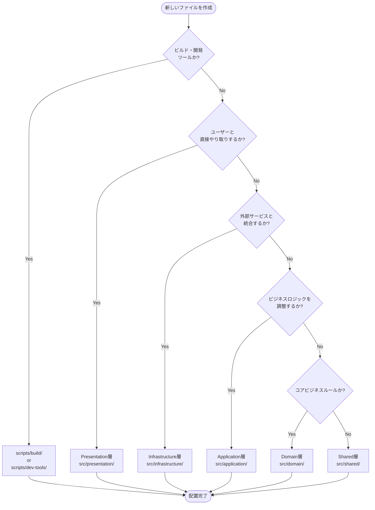

# Architecture Guide

Michi CLIプロジェクトのアーキテクチャガイドラインです。本プロジェクトはオニオンアーキテクチャの4層構造を採用し、明確な層分離と依存関係管理を実現しています。

## 目次

1. [概要](#概要)
2. [層構造](#層構造)
3. [依存関係ルール](#依存関係ルール)
4. [ファイル配置規則](#ファイル配置規則)
5. [scripts/ディレクトリ](#scriptsディレクトリ)
6. [層選択フローチャート](#層選択フローチャート)
7. [実践ガイド](#実践ガイド)

---

## 概要

### アーキテクチャパターン

Michiは**オニオンアーキテクチャ（4層構造）**を採用しています：

```
┌─────────────────────────────────────────┐
│       Presentation Layer (CLI)          │  ← ユーザーインターフェース
├─────────────────────────────────────────┤
│       Application Layer (Use Cases)     │  ← ビジネスロジック調整
├─────────────────────────────────────────┤
│    Infrastructure Layer (External APIs) │  ← 外部サービス統合
├─────────────────────────────────────────┤
│       Domain Layer (Business Logic)     │  ← コアビジネスルール
└─────────────────────────────────────────┘
```

### ハイブリッドアプローチ

本プロジェクトは、業界標準に準拠した**ハイブリッドアプローチ**を採用しています：

- **`src/` ディレクトリ**: すべてのプロダクションコード（4層構造）
- **`scripts/` ディレクトリ**: ビルドツール・開発ツール専用（層構造なし）

この分離により、プロダクションコードとビルド/開発ツールの責務を明確にしています。

---

## 層構造

### 1. Domain Layer（ドメイン層）

**責務**: コアビジネスロジック、エンティティ、値オブジェクト、ドメインサービス、定数定義

**配置場所**: `src/domain/`

**特徴**:
- **外部依存ゼロ** - 他の層やサードパーティライブラリに依存しない
- プロジェクト固有のビジネスルールのみを含む
- 最も安定した層（変更頻度が低い）

**含むもの**:
- エンティティ（`entities/`）
  - `Spec`: 仕様ドキュメント
  - `Task`: 実装タスク
  - `Project`: プロジェクト情報
- 値オブジェクト（`value-objects/`）
  - `FeatureName`: 機能名
  - `TaskStatus`: タスクステータス
  - `PhaseIdentifier`: フェーズ識別子
- ドメインサービス（`services/`）
  - `SpecValidator`: 仕様検証
  - `TaskOrchestrator`: タスク調整
- 定数（`constants/`）
  - `DEFAULT_VALUES`: デフォルト値
  - `PHASE_CONSTANTS`: フェーズ定数

**例**:
```typescript
// src/domain/entities/spec.ts
export class Spec {
  constructor(
    public readonly featureName: FeatureName,
    public readonly phase: PhaseIdentifier,
    public readonly language: string
  ) {}

  isReadyForImplementation(): boolean {
    return this.phase === 'implementation-in-progress';
  }
}
```

---

### 2. Application Layer（アプリケーション層）

**責務**: ユースケース、アプリケーションサービス、DTO、ワークフロー、テンプレート処理

**配置場所**: `src/application/`

**特徴**:
- **Domain層のみに依存** - Infrastructure層に依存しない
- ビジネスロジックを調整・組み合わせる
- 外部APIやUIとは疎結合

**含むもの**:
- ユースケース（`use-cases/`）
  - `InitSpecUseCase`: 仕様初期化
  - `GenerateDesignUseCase`: 設計書生成
  - `ExecuteTasksUseCase`: タスク実行
- アプリケーションサービス（`services/`）
  - `TemplateProcessor`: テンプレート処理
  - `WorkflowOrchestrator`: ワークフロー調整
  - `TaskGenerator`: タスク生成
- DTO（`dto/`）
  - `SpecDto`: 仕様データ転送オブジェクト
  - `TaskDto`: タスクデータ転送オブジェクト
- インターフェース（`interfaces/`）
  - `ISpecRepository`: 仕様リポジトリ
  - `IFileWriter`: ファイル書き込み
  - `ITemplateEngine`: テンプレートエンジン

**例**:
```typescript
// src/application/use-cases/init-spec.ts
import { Spec } from '@domain/entities/spec';
import { ISpecRepository } from '@application/interfaces/spec-repository';

export class InitSpecUseCase {
  constructor(private specRepo: ISpecRepository) {}

  async execute(featureName: string, description: string): Promise<Spec> {
    // ドメインロジック使用
    const spec = new Spec(featureName, 'requirements', 'ja');

    // リポジトリ保存（Infrastructure層が実装）
    await this.specRepo.save(spec);

    return spec;
  }
}
```

---

### 3. Infrastructure Layer（インフラストラクチャ層）

**責務**: 外部API、データベース、ファイルシステム、サードパーティライブラリとの統合、設定管理

**配置場所**: `src/infrastructure/`

**特徴**:
- **Application層のインターフェースを実装** - 疎結合を維持
- Domain層とApplication層に依存できる
- 外部依存の具体的な実装を含む

**含むもの**:
- 外部API統合（`external-apis/`）
  - `atlassian/jira/`: JIRA API
  - `atlassian/confluence/`: Confluence API
  - `github/`: GitHub API
- 設定管理（`config/`）
  - `ConfigLoader`: 環境変数・設定ファイル読み込み
  - `EnvValidator`: 環境変数検証
- ファイルシステム（`file-system/`）
  - `FileReader`: ファイル読み込み
  - `FileWriter`: ファイル書き込み（`IFileWriter`実装）
  - `DirectoryManager`: ディレクトリ管理
- パーサー（`parsers/`）
  - `MarkdownParser`: Markdown解析
  - `JsonParser`: JSON解析
  - `TemplateParser`: テンプレート解析

**例**:
```typescript
// src/infrastructure/file-system/file-writer.ts
import { IFileWriter } from '@application/interfaces/file-writer';

export class FileWriter implements IFileWriter {
  async write(path: string, content: string): Promise<void> {
    await fs.promises.writeFile(path, content, 'utf-8');
  }
}
```

---

### 4. Presentation Layer（プレゼンテーション層）

**責務**: CLIインターフェース、コマンドハンドラー、入出力フォーマッタ、対話型プロンプト

**配置場所**: `src/presentation/`

**特徴**:
- **すべての層に依存できる** - 最外層
- ユーザーとの接点を担当
- Commander.js、Inquirer.jsなどのUIライブラリ使用

**含むもの**:
- CLIエントリポイント（`cli.ts`）
- コマンドハンドラー（`commands/`）
  - `init/`: プロジェクト初期化
  - `confluence/`: Confluence統合
  - `jira/`: JIRA統合
  - `multi-repo/`: Multi-Repo管理
- フォーマッタ（`formatters/`）
  - `ConsoleFormatter`: コンソール出力
  - `MarkdownFormatter`: Markdown出力
  - `JsonFormatter`: JSON出力
- 対話型UI（`interactive/`）
  - `Prompter`: ユーザー入力プロンプト
  - `ProgressBar`: 進捗表示

**例**:
```typescript
// src/presentation/commands/init/init-command.ts
import { InitSpecUseCase } from '@application/use-cases/init-spec';
import { ConsoleFormatter } from '@presentation/formatters/console-formatter';

export class InitCommand {
  constructor(
    private initSpec: InitSpecUseCase,
    private formatter: ConsoleFormatter
  ) {}

  async execute(featureName: string, description: string): Promise<void> {
    const spec = await this.initSpec.execute(featureName, description);
    this.formatter.success(`仕様 ${spec.featureName} を作成しました`);
  }
}
```

---

### 5. Shared Layer（共通層）

**責務**: すべての層で使用される共通ユーティリティ、エラー型

**配置場所**: `src/shared/`

**特徴**:
- **外部依存なし** - 純粋なTypeScriptコードのみ
- 層に依存しない汎用的な機能

**含むもの**:
- ユーティリティ（`utils/`）
  - `StringUtils`: 文字列操作
  - `ArrayUtils`: 配列操作
  - `DateUtils`: 日付操作
- エラー型（`errors/`）
  - `DomainError`: ドメインエラー基底クラス
  - `ApplicationError`: アプリケーションエラー
  - `InfrastructureError`: インフラエラー

---

## 依存関係ルール

### 基本原則

依存関係は**内側から外側に向かう一方向**です：

```
Presentation → Application → Domain
     ↓              ↓
Infrastructure → Application
```

### 詳細ルール

| 層 | 依存できる層 |
|----|------------|
| **Domain** | `shared/` のみ（外部ライブラリ禁止） |
| **Application** | `domain/`, `shared/` のみ |
| **Infrastructure** | `application/`（インターフェースのみ）, `domain/`, `shared/` |
| **Presentation** | すべての層に依存可 |
| **Shared** | 外部依存なし |

### 禁止事項

❌ **Domain層から他の層へのインポート**
```typescript
// ❌ NG: Domain層からApplication層をインポート
import { InitSpecUseCase } from '@application/use-cases/init-spec';
```

❌ **Application層からInfrastructure層の具体実装をインポート**
```typescript
// ❌ NG: Application層からInfrastructure層の具体クラスをインポート
import { FileWriter } from '@infrastructure/file-system/file-writer';

// ✅ OK: インターフェースを使用
import { IFileWriter } from '@application/interfaces/file-writer';
```

❌ **循環依存**
```typescript
// ❌ NG: A → B → A の循環
// src/domain/entities/spec.ts
import { Task } from './task';

// src/domain/entities/task.ts
import { Spec } from './spec'; // 循環依存！
```

### 検証方法

依存関係ルールは**ts-arch**により自動検証されます：

```bash
# アーキテクチャテスト実行
npm run test:arch

# CI/CDで自動実行
# .github/workflows/ci.yml の architecture ジョブ
```

違反が検出された場合、ビルドが失敗します：

```
❌ Architecture test failed:
  Domain layer should not depend on Application layer
  Violation: src/domain/entities/spec.ts imports from @application/use-cases/init-spec
```

---

## ファイル配置規則

### パスエイリアス

TypeScriptパスエイリアスを使用してインポートを簡潔に記述します：

```typescript
// tsconfig.json で定義
{
  "paths": {
    "@domain/*": ["./src/domain/*"],
    "@application/*": ["./src/application/*"],
    "@infrastructure/*": ["./src/infrastructure/*"],
    "@presentation/*": ["./src/presentation/*"],
    "@shared/*": ["./src/shared/*"],
    "@spec/*": ["./.michi/*"]
  }
}
```

**使用例**:
```typescript
// 相対パスではなくエイリアス使用
import { Spec } from '@domain/entities/spec';
import { InitSpecUseCase } from '@application/use-cases/init-spec';
import { FileWriter } from '@infrastructure/file-system/file-writer';
```

### ディレクトリ構造

```
src/
├── domain/              # Domain層
│   ├── entities/       # エンティティ
│   ├── value-objects/  # 値オブジェクト
│   ├── services/       # ドメインサービス
│   └── constants/      # 定数
│
├── application/         # Application層
│   ├── use-cases/      # ユースケース
│   ├── services/       # アプリケーションサービス
│   ├── dto/            # データ転送オブジェクト
│   ├── interfaces/     # インターフェース定義
│   └── workflows/      # ワークフロー
│
├── infrastructure/      # Infrastructure層
│   ├── external-apis/  # 外部API統合
│   │   ├── atlassian/
│   │   │   ├── jira/
│   │   │   └── confluence/
│   │   └── github/
│   ├── file-system/    # ファイルシステム
│   ├── config/         # 設定管理
│   └── parsers/        # パーサー
│
├── presentation/        # Presentation層
│   ├── cli.ts          # CLIエントリポイント
│   ├── commands/       # コマンドハンドラー
│   ├── formatters/     # 出力フォーマッタ
│   └── interactive/    # 対話型UI
│
└── shared/              # Shared層
    ├── utils/          # ユーティリティ
    └── errors/         # エラー型
```

### 命名規則

| 種類 | 規則 | 例 |
|------|------|-----|
| エンティティ | PascalCase | `Spec`, `Task`, `Project` |
| 値オブジェクト | PascalCase | `FeatureName`, `TaskStatus` |
| ユースケース | `{動詞}{名詞}UseCase` | `InitSpecUseCase`, `GenerateDesignUseCase` |
| サービス | `{名詞}Service` | `SpecValidator`, `TaskOrchestrator` |
| インターフェース | `I{名詞}` | `ISpecRepository`, `IFileWriter` |
| DTO | `{名詞}Dto` | `SpecDto`, `TaskDto` |
| コマンド | `{名詞}Command` | `InitCommand`, `DesignCommand` |

---

## scripts/ディレクトリ

### 重要原則

⚠️ **scripts/はビルド・開発ツール専用です。プロダクションコードは含めないでください。**

すべてのプロダクションコード（CLIツール本体の実装）は`src/`の適切な層に配置します。

### scripts/の構造

```
scripts/
├── build/              # ビルド関連スクリプト
│   ├── copy-static-assets.js
│   └── set-permissions.js
│
├── dev-tools/          # 開発支援ツール
│   ├── test-interactive.ts
│   └── mermaid-converter.ts
│
├── utils/              # 共通ユーティリティ
│   ├── env-loader.js
│   ├── config-loader.ts
│   └── safe-file-reader.ts
│
├── config/             # 設定ファイル・スキーマ
└── constants/          # 定数定義
```

### 配置ガイドライン

| 種類 | 配置先 | 理由 |
|------|--------|------|
| **プロダクションコード** | `src/` | CLIツール本体の実装 |
| **ビルドスクリプト** | `scripts/build/` | ビルド時にのみ実行 |
| **開発ツール** | `scripts/dev-tools/` | 開発者が手動実行 |
| **テストヘルパー** | `scripts/__tests__/` | テスト専用 |

**判断基準**:
- `npm run build`で実行される → `scripts/build/`
- 開発者が手動実行する開発ツール → `scripts/dev-tools/`
- CLIコマンドとして公開される機能 → `src/presentation/commands/`
- 外部API統合 → `src/infrastructure/external-apis/`
- ビジネスロジック → `src/domain/` または `src/application/`

### Entry Points（エントリーポイント）

scripts/ルートにあるEntry Pointsは、`src/`の実装を呼び出す薄いラッパーです：

```typescript
// scripts/confluence-sync.ts (Entry Point)
import { ConfluenceSyncCommand } from '@presentation/commands/confluence/sync-command';

async function main() {
  const command = new ConfluenceSyncCommand();
  await command.execute(process.argv[2], process.argv[3]);
}

main();
```

実装本体は`src/presentation/commands/confluence/`にあります。

---

## 層選択フローチャート

新しいファイルを作成する際、以下のフローチャートに従って適切な層を選択してください：



### 判断ポイント

**1. ビルド・開発ツールか?**
- ✅ Yes: `npm run build`で実行される、または開発者が手動実行するツール
  - → `scripts/build/` または `scripts/dev-tools/`
- ❌ No: プロダクションコード → 次の質問へ

**2. ユーザーと直接やり取りするか?**
- ✅ Yes: CLIコマンド、プロンプト、出力フォーマット
  - → `src/presentation/`
- ❌ No: 内部処理 → 次の質問へ

**3. 外部サービスと統合するか?**
- ✅ Yes: 外部API、ファイルシステム、データベース、サードパーティライブラリ
  - → `src/infrastructure/`
- ❌ No: 外部依存なし → 次の質問へ

**4. ビジネスロジックを調整するか?**
- ✅ Yes: ユースケース、ワークフロー、複数ドメインサービスの組み合わせ
  - → `src/application/`
- ❌ No: 単一責務 → 次の質問へ

**5. コアビジネスルールか?**
- ✅ Yes: エンティティ、値オブジェクト、ドメインサービス、定数
  - → `src/domain/`
- ❌ No: 汎用的なユーティリティ
  - → `src/shared/`

---

## 実践ガイド

### ケーススタディ1: 新しいCLIコマンド追加

**要件**: `/michi:spec-validate <feature-name>` コマンドを追加

**実装手順**:

1. **Domain層**: バリデーションロジック
```typescript
// src/domain/services/spec-validator.ts
export class SpecValidator {
  validate(spec: Spec): ValidationResult {
    // コアビジネスルール
    if (!spec.featureName.isValid()) {
      return { valid: false, errors: ['Invalid feature name'] };
    }
    return { valid: true, errors: [] };
  }
}
```

2. **Application層**: ユースケース
```typescript
// src/application/use-cases/validate-spec.ts
export class ValidateSpecUseCase {
  constructor(
    private specRepo: ISpecRepository,
    private validator: SpecValidator
  ) {}

  async execute(featureName: string): Promise<ValidationResult> {
    const spec = await this.specRepo.findByFeatureName(featureName);
    return this.validator.validate(spec);
  }
}
```

3. **Infrastructure層**: リポジトリ実装
```typescript
// src/infrastructure/repositories/spec-repository.ts
export class SpecRepository implements ISpecRepository {
  async findByFeatureName(name: string): Promise<Spec> {
    const data = await fs.promises.readFile(`.michi/specs/${name}/spec.json`);
    return JSON.parse(data.toString());
  }
}
```

4. **Presentation層**: コマンドハンドラー
```typescript
// src/presentation/commands/validate/validate-command.ts
export class ValidateCommand {
  constructor(
    private validateSpec: ValidateSpecUseCase,
    private formatter: ConsoleFormatter
  ) {}

  async execute(featureName: string): Promise<void> {
    const result = await this.validateSpec.execute(featureName);
    if (result.valid) {
      this.formatter.success('Validation passed');
    } else {
      this.formatter.error(result.errors);
    }
  }
}
```

5. **Presentation層**: CLI登録
```typescript
// src/presentation/cli.ts
import { ValidateCommand } from './commands/validate/validate-command';

program
  .command('spec:validate <feature-name>')
  .action(async (featureName) => {
    const command = new ValidateCommand(/* DI */);
    await command.execute(featureName);
  });
```

---

### ケーススタディ2: 外部API統合追加

**要件**: Slack通知機能を追加

**実装手順**:

1. **Application層**: インターフェース定義
```typescript
// src/application/interfaces/notification-service.ts
export interface INotificationService {
  notify(message: string): Promise<void>;
}
```

2. **Infrastructure層**: Slack実装
```typescript
// src/infrastructure/external-apis/slack/slack-notifier.ts
import { INotificationService } from '@application/interfaces/notification-service';

export class SlackNotifier implements INotificationService {
  async notify(message: string): Promise<void> {
    await axios.post(process.env.SLACK_WEBHOOK_URL!, { text: message });
  }
}
```

3. **Application層**: 通知ユースケース
```typescript
// src/application/use-cases/notify-completion.ts
export class NotifyCompletionUseCase {
  constructor(private notifier: INotificationService) {}

  async execute(featureName: string): Promise<void> {
    await this.notifier.notify(`Feature ${featureName} completed!`);
  }
}
```

4. **Presentation層**: 既存コマンドに統合
```typescript
// src/presentation/commands/impl/impl-command.ts
export class ImplCommand {
  constructor(
    private executeTask: ExecuteTasksUseCase,
    private notifyCompletion: NotifyCompletionUseCase
  ) {}

  async execute(featureName: string): Promise<void> {
    await this.executeTask.execute(featureName);
    await this.notifyCompletion.execute(featureName);
  }
}
```

---

### ベストプラクティス

#### 1. インターフェース駆動設計

Application層でインターフェースを定義し、Infrastructure層で実装します：

```typescript
// ✅ Good: Application層がインターフェースに依存
export class InitSpecUseCase {
  constructor(private writer: IFileWriter) {}
}

// ❌ Bad: Application層が具体実装に依存
import { FileWriter } from '@infrastructure/file-system/file-writer';
export class InitSpecUseCase {
  constructor(private writer: FileWriter) {}
}
```

#### 2. 依存性注入

コンストラクタ注入を使用して疎結合を実現します：

```typescript
// Presentation層で依存関係を組み立て
const fileWriter = new FileWriter();
const specRepo = new SpecRepository(fileWriter);
const initSpec = new InitSpecUseCase(specRepo);
const command = new InitCommand(initSpec, new ConsoleFormatter());
```

#### 3. エラーハンドリング

各層で適切なエラー型を使用します：

```typescript
// Domain層
export class DomainError extends Error {
  constructor(message: string) {
    super(message);
    this.name = 'DomainError';
  }
}

// Application層
export class ApplicationError extends Error {
  constructor(message: string) {
    super(message);
    this.name = 'ApplicationError';
  }
}

// Infrastructure層
export class InfrastructureError extends Error {
  constructor(message: string) {
    super(message);
    this.name = 'InfrastructureError';
  }
}
```

#### 4. テスト戦略

各層に応じたテスト戦略を採用します：

| 層 | テスト種別 | フォーカス |
|----|-----------|----------|
| Domain | ユニットテスト | ビジネスロジックの正確性 |
| Application | ユニットテスト | ユースケースフロー |
| Infrastructure | 統合テスト | 外部サービス連携 |
| Presentation | E2Eテスト | ユーザーフロー |

---

## まとめ

### 重要ポイント

1. **4層構造を遵守する**: Domain → Application → Infrastructure → Presentation
2. **依存関係は一方向**: 内側から外側へ
3. **Domain層は純粋に保つ**: 外部依存ゼロ
4. **scripts/はビルド・開発ツール専用**: プロダクションコードは `src/` に配置
5. **インターフェース駆動設計**: Application層でインターフェース定義、Infrastructure層で実装
6. **ts-archで自動検証**: 依存関係ルール違反を検出

### 参考資料

- [Design Document](.michi/specs/onion-architecture/design.md) - 詳細設計
- [Requirements Document](.michi/specs/onion-architecture/requirements.md) - 要件定義
- [Migration Guide](./MIGRATION.md) - 移行ガイド
- [scripts/README.md](../scripts/README.md) - scripts/ディレクトリガイド

### サポート

質問や不明点がある場合:
- [GitHub Issues](https://github.com/sk8metalme/michi/issues)
- [Architecture Discussion](https://github.com/sk8metalme/michi/discussions)

---

**Last Updated**: 2026-01-01
**Version**: 0.19.0
