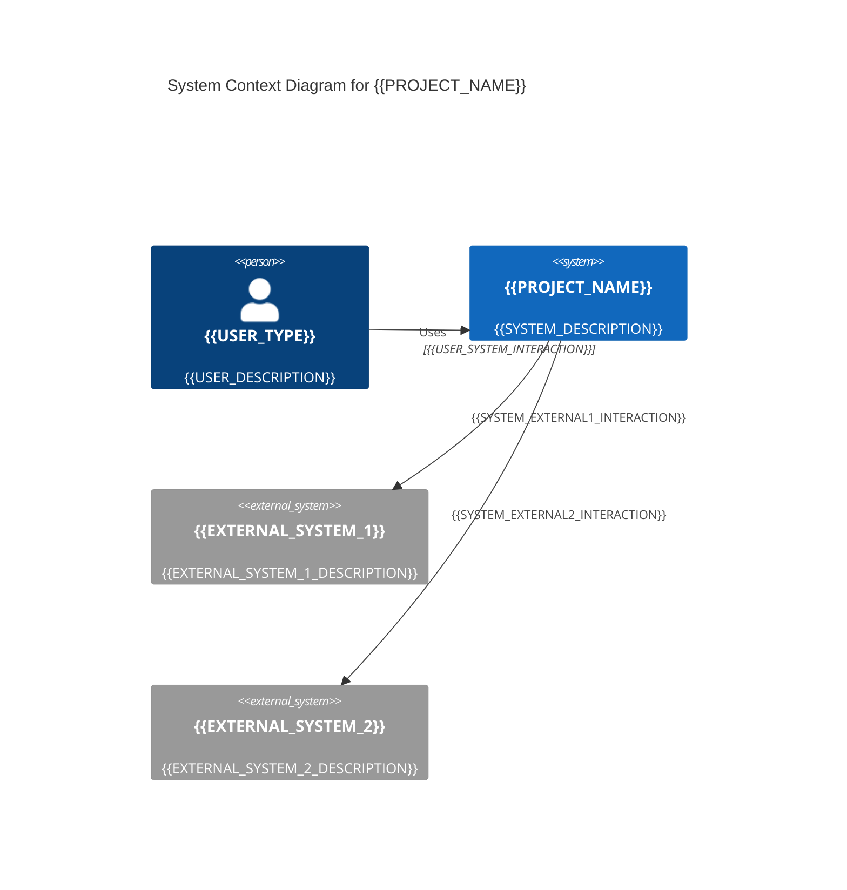
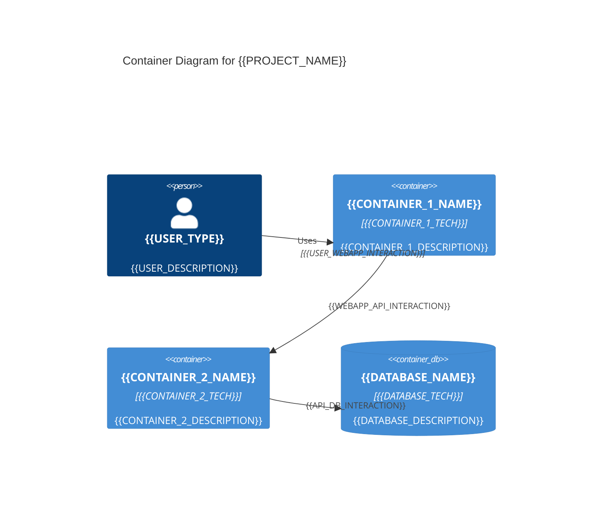

# システムアーキテクチャ

<!--
このファイルは、システム全体のアーキテクチャを文書化します。
C4モデルのContext/Container/Componentレベルで、システムの構成とコンポーネント間の関係を説明します。
すべてのコンポーネントをリスト化するのではなく、アーキテクチャのパターンと設計判断を記述します。
-->

## アーキテクチャ概要

<!-- システムの全体的なアーキテクチャスタイルと特徴を記述 -->

**アーキテクチャスタイル**: {{ARCHITECTURE_STYLE}}
（例: マイクロサービス、モノリシック、レイヤードアーキテクチャ、クリーンアーキテクチャ等）

{{ARCHITECTURE_OVERVIEW}}

## C4モデル: コンテキスト図

<!-- システムの境界と外部システムとの関係を示す -->



**説明**:
- **{{USER_TYPE}}**: {{USER_ROLE_DESCRIPTION}}
- **{{EXTERNAL_SYSTEM_1}}**: {{EXTERNAL_SYSTEM_1_DETAIL}}
- **{{EXTERNAL_SYSTEM_2}}**: {{EXTERNAL_SYSTEM_2_DETAIL}}

## C4モデル: コンテナ図

<!-- システム内の主要なコンテナ（アプリケーション、データベース、サービス等）を示す -->



**説明**:
- **{{CONTAINER_1_NAME}}**: {{CONTAINER_1_DETAIL}}
- **{{CONTAINER_2_NAME}}**: {{CONTAINER_2_DETAIL}}
- **{{DATABASE_NAME}}**: {{DATABASE_DETAIL}}

## コンポーネント構成パターン

<!-- 主要なコンポーネントの構成パターンを記述（すべてのコンポーネントをリスト化しない） -->

### {{COMPONENT_PATTERN_1}}

**目的**: {{COMPONENT_PATTERN_1_PURPOSE}}

**構成例**:
```
{{COMPONENT_PATTERN_1_STRUCTURE}}
```

**責務**:
- {{COMPONENT_PATTERN_1_RESPONSIBILITY_1}}
- {{COMPONENT_PATTERN_1_RESPONSIBILITY_2}}
- {{COMPONENT_PATTERN_1_RESPONSIBILITY_3}}

### {{COMPONENT_PATTERN_2}}

**目的**: {{COMPONENT_PATTERN_2_PURPOSE}}

**構成例**:
```
{{COMPONENT_PATTERN_2_STRUCTURE}}
```

**責務**:
- {{COMPONENT_PATTERN_2_RESPONSIBILITY_1}}
- {{COMPONENT_PATTERN_2_RESPONSIBILITY_2}}
- {{COMPONENT_PATTERN_2_RESPONSIBILITY_3}}

## データフロー

<!-- システム内の主要なデータフローを記述 -->

```mermaid
flowchart LR
    A[{{DATA_SOURCE}}] -->|{{DATA_FLOW_1}}| B[{{DATA_PROCESSOR_1}}]
    B -->|{{DATA_FLOW_2}}| C[{{DATA_PROCESSOR_2}}]
    C -->|{{DATA_FLOW_3}}| D[{{DATA_DESTINATION}}]
```

**説明**:
{{DATA_FLOW_DESCRIPTION}}

## インフラストラクチャ

<!-- インフラストラクチャの構成パターンを記述 -->

### デプロイメント構成

**環境**: {{DEPLOYMENT_ENVIRONMENTS}}
（例: 開発、ステージング、本番）

**デプロイメントパターン**: {{DEPLOYMENT_PATTERN}}
（例: Blue-Green、Canary、Rolling Update）

### スケーリング戦略

{{SCALING_STRATEGY}}

## アーキテクチャ上の重要な決定

<!-- アーキテクチャに関する重要な判断とその理由を記述 -->

### {{DECISION_1}}

**決定内容**: {{DECISION_1_CONTENT}}

**理由**: {{DECISION_1_RATIONALE}}

**トレードオフ**: {{DECISION_1_TRADEOFFS}}

### {{DECISION_2}}

**決定内容**: {{DECISION_2_CONTENT}}

**理由**: {{DECISION_2_RATIONALE}}

**トレードオフ**: {{DECISION_2_TRADEOFFS}}

## セキュリティアーキテクチャ

<!-- セキュリティに関するアーキテクチャパターンを記述（具体的な認証情報は含めない） -->

### 認証・認可

{{AUTH_ARCHITECTURE}}

### データ保護

{{DATA_PROTECTION_ARCHITECTURE}}

### ネットワークセキュリティ

{{NETWORK_SECURITY_ARCHITECTURE}}

## 参照

- 詳細な技術スタック: [tech-stack.md](./tech-stack.md)
- プロジェクト構造: [structure.md](./structure.md)
- 主要フロー: [sequence.md](./sequence.md)
