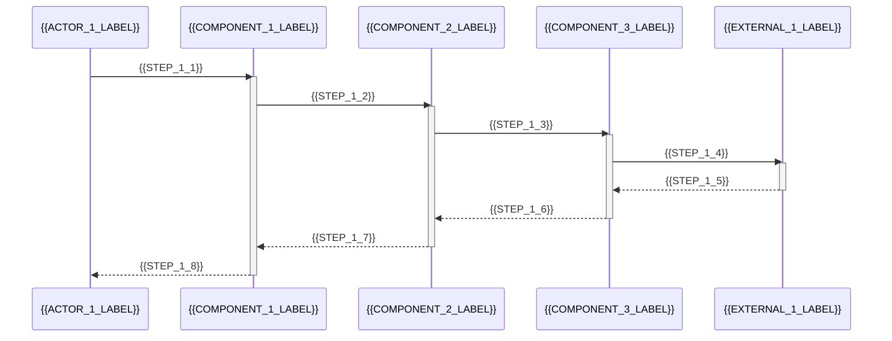
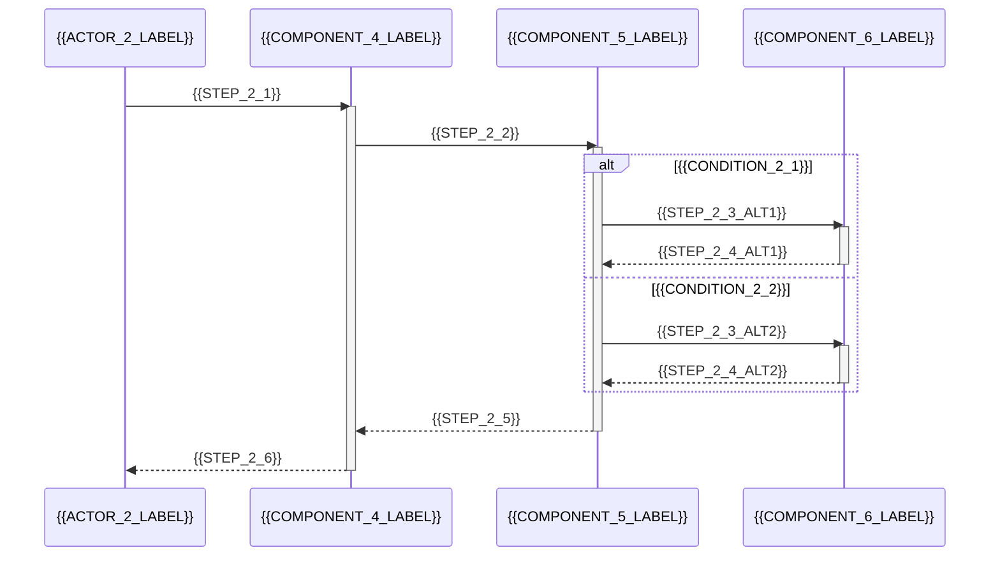
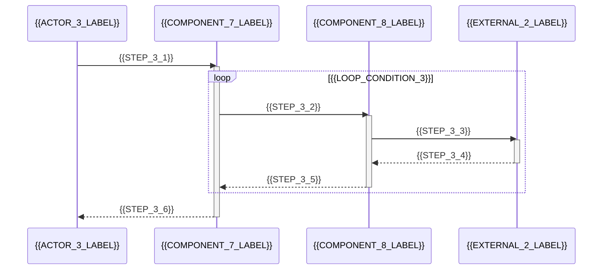
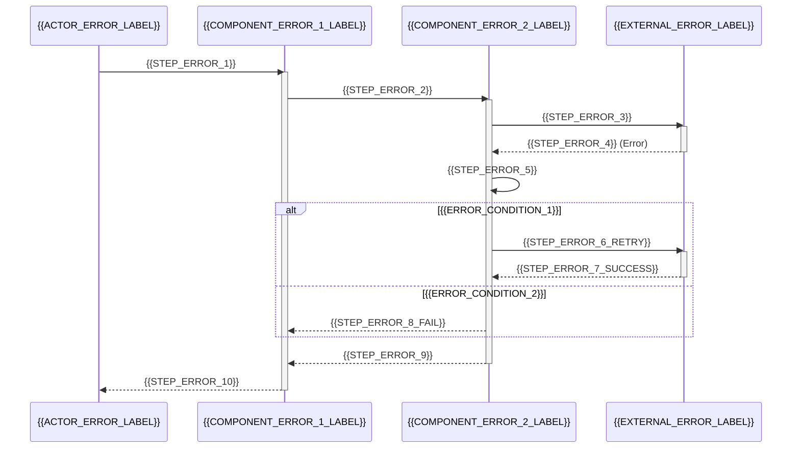
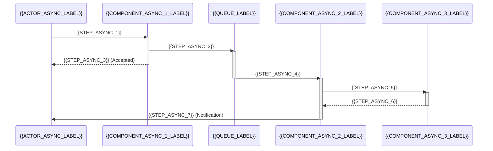

# シーケンス図

<!--
このファイルは、システムの主要なフローをシーケンス図で文書化します。
すべてのフローを網羅するのではなく、重要なユースケースとビジネスロジックを理解するための代表的なフローを記述します。
-->

## シーケンス図の目的

このドキュメントでは、{{PROJECT_NAME}}の主要なフローをシーケンス図で可視化します。

**フォーカス**:
- コアビジネスロジックのフロー
- 複数コンポーネント間の相互作用
- エラーハンドリングとリトライロジック
- 外部システムとの統合

## 主要フロー1: {{FLOW_1_NAME}}

### 概要

{{FLOW_1_DESCRIPTION}}

### シーケンス図

### ステップ詳細

1. **{{STEP_1_1}}**: {{STEP_1_1_DETAIL}}
2. **{{STEP_1_2}}**: {{STEP_1_2_DETAIL}}
3. **{{STEP_1_3}}**: {{STEP_1_3_DETAIL}}
4. **{{STEP_1_4}}**: {{STEP_1_4_DETAIL}}
5. **{{STEP_1_5}}**: {{STEP_1_5_DETAIL}}
6. **{{STEP_1_6}}**: {{STEP_1_6_DETAIL}}
7. **{{STEP_1_7}}**: {{STEP_1_7_DETAIL}}
8. **{{STEP_1_8}}**: {{STEP_1_8_DETAIL}}

### エラーハンドリング

{{FLOW_1_ERROR_HANDLING}}

---

## 主要フロー2: {{FLOW_2_NAME}}

### 概要

{{FLOW_2_DESCRIPTION}}

### シーケンス図

### ステップ詳細

1. **{{STEP_2_1}}**: {{STEP_2_1_DETAIL}}
2. **{{STEP_2_2}}**: {{STEP_2_2_DETAIL}}
3. **条件分岐**:
   - **{{CONDITION_2_1}}**: {{CONDITION_2_1_DETAIL}}
   - **{{CONDITION_2_2}}**: {{CONDITION_2_2_DETAIL}}
4. **{{STEP_2_5}}**: {{STEP_2_5_DETAIL}}
5. **{{STEP_2_6}}**: {{STEP_2_6_DETAIL}}

### エラーハンドリング

{{FLOW_2_ERROR_HANDLING}}

---

## 主要フロー3: {{FLOW_3_NAME}}

### 概要

{{FLOW_3_DESCRIPTION}}

### シーケンス図

### ステップ詳細

1. **{{STEP_3_1}}**: {{STEP_3_1_DETAIL}}
2. **ループ処理 ({{LOOP_CONDITION_3}})**:
   - **{{STEP_3_2}}**: {{STEP_3_2_DETAIL}}
   - **{{STEP_3_3}}**: {{STEP_3_3_DETAIL}}
   - **{{STEP_3_4}}**: {{STEP_3_4_DETAIL}}
   - **{{STEP_3_5}}**: {{STEP_3_5_DETAIL}}
3. **{{STEP_3_6}}**: {{STEP_3_6_DETAIL}}

### エラーハンドリング

{{FLOW_3_ERROR_HANDLING}}

---

## エラーフロー: {{ERROR_FLOW_NAME}}

### 概要

{{ERROR_FLOW_DESCRIPTION}}

### シーケンス図

### ステップ詳細

1. **{{STEP_ERROR_1}}**: {{STEP_ERROR_1_DETAIL}}
2. **{{STEP_ERROR_2}}**: {{STEP_ERROR_2_DETAIL}}
3. **{{STEP_ERROR_3}}**: {{STEP_ERROR_3_DETAIL}}
4. **{{STEP_ERROR_4}}**: {{STEP_ERROR_4_DETAIL}}
5. **{{STEP_ERROR_5}}**: {{STEP_ERROR_5_DETAIL}}
6. **リトライロジック**:
   - **{{ERROR_CONDITION_1}}**: {{ERROR_CONDITION_1_DETAIL}}
   - **{{ERROR_CONDITION_2}}**: {{ERROR_CONDITION_2_DETAIL}}

### リトライ戦略

{{ERROR_FLOW_RETRY_STRATEGY}}

---

## 非同期処理フロー: {{ASYNC_FLOW_NAME}}

### 概要

{{ASYNC_FLOW_DESCRIPTION}}

### シーケンス図

### ステップ詳細

1. **{{STEP_ASYNC_1}}**: {{STEP_ASYNC_1_DETAIL}}
2. **{{STEP_ASYNC_2}}**: {{STEP_ASYNC_2_DETAIL}}
3. **{{STEP_ASYNC_3}}**: {{STEP_ASYNC_3_DETAIL}}
4. **{{STEP_ASYNC_4}}**: {{STEP_ASYNC_4_DETAIL}}
5. **{{STEP_ASYNC_5}}**: {{STEP_ASYNC_5_DETAIL}}
6. **{{STEP_ASYNC_6}}**: {{STEP_ASYNC_6_DETAIL}}
7. **{{STEP_ASYNC_7}}**: {{STEP_ASYNC_7_DETAIL}}

### 非同期処理の考慮事項

{{ASYNC_FLOW_CONSIDERATIONS}}

---

## フロー図の凡例

### 参加者（Participant）

- **{{ACTOR_TYPE}}**: ユーザーや外部アクター
- **{{COMPONENT_TYPE}}**: システム内のコンポーネント
- **{{EXTERNAL_TYPE}}**: 外部システムやサービス

### 相互作用

- **実線矢印 (→)**: 同期呼び出し
- **破線矢印 (-->)**: レスポンス
- **activate/deactivate**: ライフラインの活性化

### 制御構造

- **alt/else**: 条件分岐
- **loop**: ループ処理
- **opt**: オプション処理

## 参照

- アーキテクチャ概要: [architecture.md](./architecture.md)
- API設計: [../development/api-design.md](../development/api-design.md)
- データモデル: [../development/data-model.md](../development/data-model.md)
