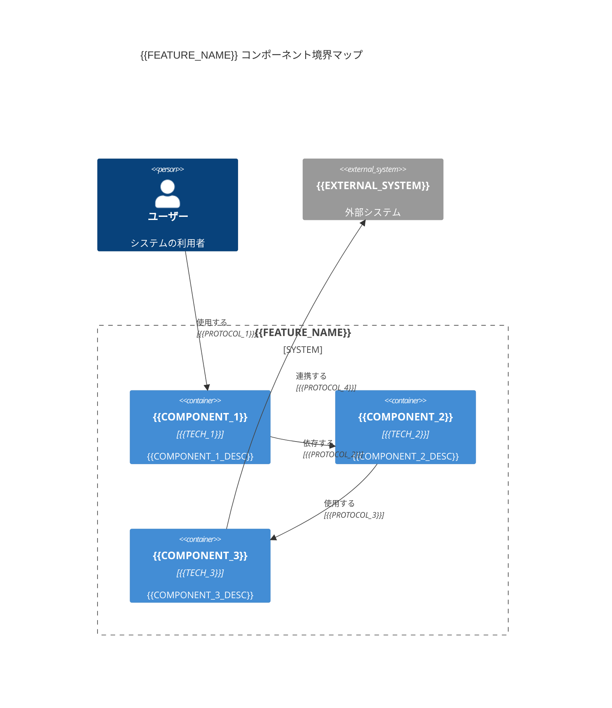
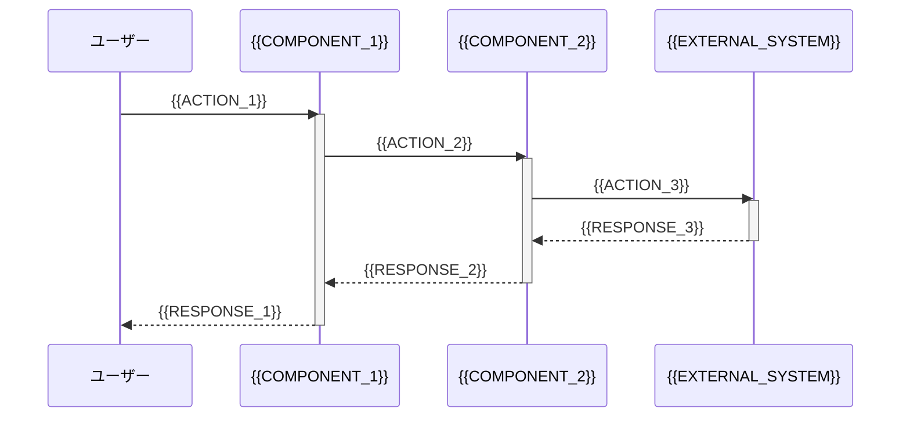
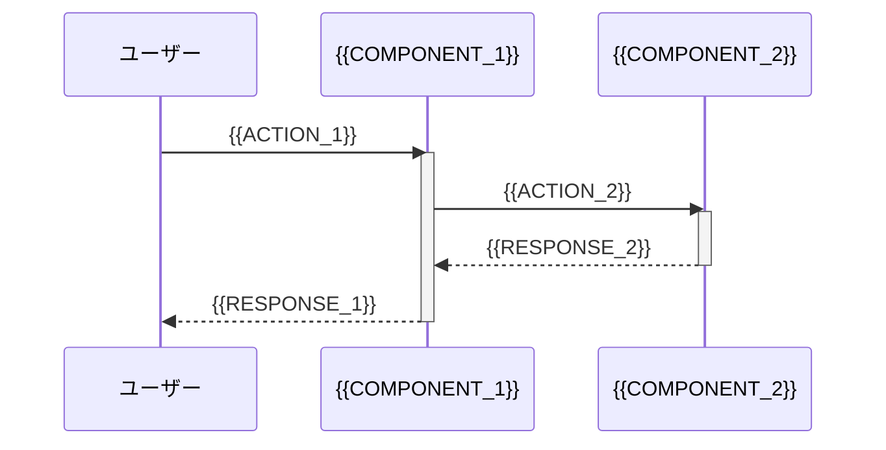

---
# 設計書テンプレート
# このテンプレートは /michi:create-design コマンドで生成される構造を定義します
# プレースホルダー（{{...}}）は生成時に実際の値に置き換えられます
feature: {{FEATURE_NAME}}
created_at: {{CREATED_AT}}
updated_at: {{UPDATED_AT}}
language: {{LANGUAGE}}
phase: design-generated
---

# 設計書: {{FEATURE_NAME}}

<!-- 要件（WHAT）をアーキテクチャ設計（HOW）に変換する包括的な技術設計ドキュメント -->

## 概要

<!-- この設計書の目的とスコープを簡潔に説明します -->

{{DESIGN_OVERVIEW}}

---

## Architecture Pattern & Boundary Map

<!-- アーキテクチャパターンとコンポーネント境界を定義します -->
<!-- 推奨: Mermaid図を使用して視覚的に表現 -->

### 選択したアーキテクチャパターン

<!--
例:
- Layered Architecture (レイヤードアーキテクチャ)
- Hexagonal Architecture (ヘキサゴナルアーキテクチャ)
- Clean Architecture (クリーンアーキテクチャ)
- Microservices Architecture (マイクロサービスアーキテクチャ)
-->

**パターン名**: {{ARCHITECTURE_PATTERN}}

**選択理由**:
{{PATTERN_RATIONALE}}

**参照**: `docs/michi/{{FEATURE_NAME}}/research/research.md` の「アーキテクチャパターン評価」セクション

---

### コンポーネント境界マップ

<!-- Mermaid C4図でコンポーネント間の境界と依存関係を視覚化 -->



---

## Technology Stack & Alignment

<!-- 技術スタックとマスタードキュメントとの整合性を確認 -->

### 使用技術

<!-- 各レイヤー/コンポーネントで使用する技術を明記 -->

| レイヤー/コンポーネント | 技術 | バージョン | 選定理由 |
|------------------------|------|----------|---------|
| {{LAYER_1}} | {{TECH_1}} | {{VERSION_1}} | {{RATIONALE_1}} |
| {{LAYER_2}} | {{TECH_2}} | {{VERSION_2}} | {{RATIONALE_2}} |
| {{LAYER_3}} | {{TECH_3}} | {{VERSION_3}} | {{RATIONALE_3}} |
| {{LAYER_4}} | {{TECH_4}} | {{VERSION_4}} | {{RATIONALE_4}} |

---

### マスタードキュメントとの整合性

<!-- docs/master/ の技術スタックとの整合性を確認 -->

**参照**:
- `docs/master/tech.md` - プロジェクト技術スタック
- `docs/master/structure.md` - プロジェクト構造
- `docs/master/product.md` - プロダクト仕様

**整合性チェック**:
- [ ] 使用技術がマスタードキュメントと一致
- [ ] プロジェクト標準パターンを踏襲
- [ ] 既存のコンポーネントと互換性がある

---

## Components & Interface Contracts

<!-- コンポーネントの詳細とインターフェース契約を定義 -->

### Component 1: {{COMPONENT_1_NAME}}

**責務**:
{{COMPONENT_1_RESPONSIBILITY}}

**依存関係**:
- {{DEPENDENCY_1}}
- {{DEPENDENCY_2}}

**公開インターフェース**:

```typescript
// 型安全性を重視したインターフェース定義
// TypeScriptの例（他の言語の場合は適切な型定義を使用）

interface {{INTERFACE_1_NAME}} {
  {{METHOD_1}}({{PARAM_1}}: {{TYPE_1}}): Promise<{{RETURN_TYPE_1}}>;
  {{METHOD_2}}({{PARAM_2}}: {{TYPE_2}}): {{RETURN_TYPE_2}};
}

// データ型定義
type {{TYPE_1}} = {
  {{FIELD_1}}: {{FIELD_TYPE_1}};
  {{FIELD_2}}: {{FIELD_TYPE_2}};
};
```

**エラーハンドリング**:
- {{ERROR_CASE_1}}: {{ERROR_HANDLING_1}}
- {{ERROR_CASE_2}}: {{ERROR_HANDLING_2}}

**参照**: `research.md` の「{{COMPONENT_1_NAME}} 実装詳細」セクション

---

### Component 2: {{COMPONENT_2_NAME}}

**責務**:
{{COMPONENT_2_RESPONSIBILITY}}

**依存関係**:
- {{DEPENDENCY_1}}
- {{DEPENDENCY_2}}

**公開インターフェース**:

```typescript
interface {{INTERFACE_2_NAME}} {
  {{METHOD_1}}({{PARAM_1}}: {{TYPE_1}}): Promise<{{RETURN_TYPE_1}}>;
  {{METHOD_2}}({{PARAM_2}}: {{TYPE_2}}): {{RETURN_TYPE_2}};
}
```

**エラーハンドリング**:
- {{ERROR_CASE_1}}: {{ERROR_HANDLING_1}}
- {{ERROR_CASE_2}}: {{ERROR_HANDLING_2}}

---

### Component 3: {{COMPONENT_3_NAME}}

**責務**:
{{COMPONENT_3_RESPONSIBILITY}}

**依存関係**:
- {{DEPENDENCY_1}}
- {{DEPENDENCY_2}}

**公開インターフェース**:

```typescript
interface {{INTERFACE_3_NAME}} {
  {{METHOD_1}}({{PARAM_1}}: {{TYPE_1}}): Promise<{{RETURN_TYPE_1}}>;
  {{METHOD_2}}({{PARAM_2}}: {{TYPE_2}}): {{RETURN_TYPE_2}};
}
```

**エラーハンドリング**:
- {{ERROR_CASE_1}}: {{ERROR_HANDLING_1}}
- {{ERROR_CASE_2}}: {{ERROR_HANDLING_2}}

---

## Data Models

<!-- データモデルとスキーマ定義 -->

### Entity 1: {{ENTITY_1_NAME}}

```typescript
// 型安全なデータモデル定義
type {{ENTITY_1_NAME}} = {
  id: string;                    // 一意識別子
  {{FIELD_1}}: {{TYPE_1}};       // {{FIELD_1_DESCRIPTION}}
  {{FIELD_2}}: {{TYPE_2}};       // {{FIELD_2_DESCRIPTION}}
  {{FIELD_3}}: {{TYPE_3}} | null; // {{FIELD_3_DESCRIPTION}}（オプション）
  createdAt: Date;               // 作成日時
  updatedAt: Date;               // 更新日時
};
```

**バリデーションルール**:
- {{FIELD_1}}: {{VALIDATION_RULE_1}}
- {{FIELD_2}}: {{VALIDATION_RULE_2}}

---

### Entity 2: {{ENTITY_2_NAME}}

```typescript
type {{ENTITY_2_NAME}} = {
  id: string;
  {{FIELD_1}}: {{TYPE_1}};
  {{FIELD_2}}: {{TYPE_2}};
  createdAt: Date;
  updatedAt: Date;
};
```

**バリデーションルール**:
- {{FIELD_1}}: {{VALIDATION_RULE_1}}
- {{FIELD_2}}: {{VALIDATION_RULE_2}}

---

## Integration Points

<!-- 外部システムや既存コンポーネントとの統合ポイント -->

### 統合 1: {{INTEGRATION_1_NAME}}

**統合先**: {{EXTERNAL_SYSTEM_1}}

**プロトコル**: {{PROTOCOL}} (例: REST API, GraphQL, gRPC)

**認証方式**: {{AUTH_METHOD}} (例: OAuth 2.0, API Key, JWT)

**エンドポイント**:
- {{ENDPOINT_1}}: {{DESCRIPTION_1}}
- {{ENDPOINT_2}}: {{DESCRIPTION_2}}

**データフォーマット**: {{DATA_FORMAT}} (例: JSON, Protocol Buffers)

**エラーハンドリング**:
- {{ERROR_SCENARIO_1}}: {{HANDLING_STRATEGY_1}}
- {{ERROR_SCENARIO_2}}: {{HANDLING_STRATEGY_2}}

**参照**: `research.md` の「外部APIコントラクトと制約」セクション

---

### 統合 2: {{INTEGRATION_2_NAME}}

**統合先**: {{EXTERNAL_SYSTEM_2}}

**プロトコル**: {{PROTOCOL}}

**認証方式**: {{AUTH_METHOD}}

**エンドポイント**:
- {{ENDPOINT_1}}: {{DESCRIPTION_1}}
- {{ENDPOINT_2}}: {{DESCRIPTION_2}}

**データフォーマット**: {{DATA_FORMAT}}

**エラーハンドリング**:
- {{ERROR_SCENARIO_1}}: {{HANDLING_STRATEGY_1}}
- {{ERROR_SCENARIO_2}}: {{HANDLING_STRATEGY_2}}

---

## Sequence Diagrams

<!-- 主要なユースケースのシーケンス図 -->

### ユースケース 1: {{USE_CASE_1}}



---

### ユースケース 2: {{USE_CASE_2}}



---

## Testing Strategy

<!-- テスト戦略とテスト計画 -->

### テストタイプ

<!-- Phase 4（テスト計画）で詳細化される項目 -->

**単体テスト (Unit Test)**:
- 対象: {{UNIT_TEST_TARGET}}
- フレームワーク: {{UNIT_TEST_FRAMEWORK}}
- カバレッジ目標: 95%以上

**統合テスト (Integration Test)**:
- 対象: {{INTEGRATION_TEST_TARGET}}
- フレームワーク: {{INTEGRATION_TEST_FRAMEWORK}}
- テストケース数: {{INTEGRATION_TEST_COUNT}}

**E2Eテスト (End-to-End Test)**:
- 対象: {{E2E_TEST_TARGET}}
- フレームワーク: {{E2E_TEST_FRAMEWORK}}
- テストシナリオ数: {{E2E_TEST_COUNT}}

**パフォーマンステスト (Performance Test)**:
- 対象: {{PERFORMANCE_TEST_TARGET}}
- ツール: {{PERFORMANCE_TEST_TOOL}}
- 目標値: {{PERFORMANCE_GOAL}}

---

### テスト計画

**Phase 4で実施**:
1. `/michi:plan-tests {{FEATURE_NAME}}` を実行
2. テストタイプを選択
3. テスト仕様書を作成

**参照**: `docs/user-guide/testing/test-planning-flow.md`

---

## Risk Assessment

<!-- リスクと緩和策 -->
<!-- research.md で特定されたリスクを参照 -->

### リスク 1: {{RISK_1_NAME}}

**影響度**: {{IMPACT}} (高/中/低)

**発生確率**: {{PROBABILITY}} (高/中/低)

**緩和策**:
{{MITIGATION_STRATEGY_1}}

**参照**: `research.md` の「リスク」セクション

---

### リスク 2: {{RISK_2_NAME}}

**影響度**: {{IMPACT}}

**発生確率**: {{PROBABILITY}}

**緩和策**:
{{MITIGATION_STRATEGY_2}}

---

## Performance Considerations

<!-- パフォーマンス考慮事項 -->

### ボトルネック予測

1. **{{BOTTLENECK_1}}**:
   - 影響: {{IMPACT_1}}
   - 対策: {{SOLUTION_1}}

2. **{{BOTTLENECK_2}}**:
   - 影響: {{IMPACT_2}}
   - 対策: {{SOLUTION_2}}

---

### 最適化戦略

1. {{OPTIMIZATION_1}}
2. {{OPTIMIZATION_2}}
3. {{OPTIMIZATION_3}}

---

## Security Considerations

<!-- セキュリティ考慮事項 -->

### セキュリティ要件

1. **認証**: {{AUTH_REQUIREMENT}}
2. **認可**: {{AUTHZ_REQUIREMENT}}
3. **データ保護**: {{DATA_PROTECTION_REQUIREMENT}}
4. **監査ログ**: {{AUDIT_LOG_REQUIREMENT}}

---

### セキュリティリスク

1. **{{SECURITY_RISK_1}}**:
   - 対策: {{SECURITY_MITIGATION_1}}

2. **{{SECURITY_RISK_2}}**:
   - 対策: {{SECURITY_MITIGATION_2}}

---

## Prerequisites (前提条件)

<!-- 実装前に必要な環境整備 -->

### 品質インフラ要件

<!-- /michi:create-design で自動追加される言語別の品質インフラ要件 -->

**言語**: {{DETECTED_LANGUAGE}}

**必須項目**:
- [ ] {{REQUIRED_TOOL_1}}
- [ ] {{REQUIRED_TOOL_2}}
- [ ] CI/CD設定 ({{CI_PLATFORM}})

**推奨項目**:
- [ ] {{RECOMMENDED_TOOL_1}}
- [ ] {{RECOMMENDED_TOOL_2}}

**参照**: 品質インフラチェック結果（コマンド出力）

---

## Requirements Traceability

<!-- 要件と設計要素のトレーサビリティマトリックス -->

| 要件ID | 要件名 | 対応コンポーネント | 対応インターフェース |
|--------|--------|------------------|-------------------|
| {{REQ_ID_1}} | {{REQ_NAME_1}} | {{COMPONENT_1}} | {{INTERFACE_1}} |
| {{REQ_ID_2}} | {{REQ_NAME_2}} | {{COMPONENT_2}} | {{INTERFACE_2}} |
| {{REQ_ID_3}} | {{REQ_NAME_3}} | {{COMPONENT_3}} | {{INTERFACE_3}} |

**注意**: 要件IDは requirements.md で定義された数値IDのみを使用

---

## Design Decisions

<!-- 重要な設計決定とその根拠 -->
<!-- research.md から参照 -->

### 決定 1: {{DECISION_1}}

**決定事項**: {{DECISION_CONTENT_1}}

**根拠**: {{RATIONALE_1}}

**代替案**: {{ALTERNATIVE_1}}

**参照**: `research.md` の「設計決定」セクション

---

### 決定 2: {{DECISION_2}}

**決定事項**: {{DECISION_CONTENT_2}}

**根拠**: {{RATIONALE_2}}

**代替案**: {{ALTERNATIVE_2}}

---

## Future Enhancements

<!-- 将来的な拡張可能性 -->

1. {{ENHANCEMENT_1}}
2. {{ENHANCEMENT_2}}
3. {{ENHANCEMENT_3}}

---

## References

<!-- 参照ドキュメント -->

- `docs/michi/{{FEATURE_NAME}}/research/research.md` - 調査ログ
- `docs/michi/{{FEATURE_NAME}}/spec/requirements.md` - 要件定義書
- `docs/master/tech.md` - プロジェクト技術スタック
- `docs/master/structure.md` - プロジェクト構造
- {{EXTERNAL_REFERENCE_1}}
- {{EXTERNAL_REFERENCE_2}}

---

## 重要な注意事項

<!--
テンプレート使用時の注意点:
1. 型安全性を重視し、明示的な型/インターフェースを定義する
2. TypeScriptの場合、`any`を使用せず、正確な型とジェネリクスを使用
3. Mermaid図で視覚的にコミュニケーションする
4. アーキテクチャとインターフェースのみに焦点を当て、実装コードは含めない
5. research.md との整合性を保つ
6. マスタードキュメントコンテキストと整合させる
7. テンプレート構造と生成指示に厳密に従う
-->
