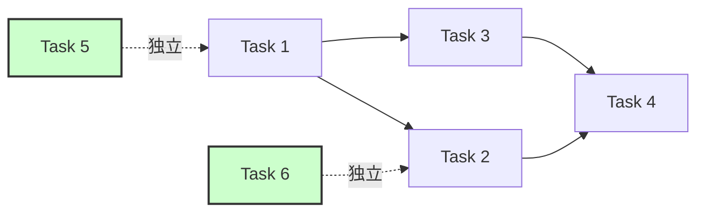

---
# 調査ログテンプレート
# このテンプレートは /michi:create-design コマンドの発見フェーズで生成される構造を定義します
# プレースホルダー（{{...}}）は生成時に実際の値に置き換えられます
feature: {{FEATURE_NAME}}
created_at: {{CREATED_AT}}
updated_at: {{UPDATED_AT}}
discovery_type: {{DISCOVERY_TYPE}}  # full / light / minimal
language: {{LANGUAGE}}
---

# 調査ログ: {{FEATURE_NAME}}

<!--
このドキュメントは、設計段階で実施した調査の記録です。
- 外部APIやライブラリの調査結果
- アーキテクチャパターンの評価
- 技術決定とその根拠
- 特定されたリスクと緩和策

design.md から参照され、設計の根拠を提供します。
-->

## サマリー

<!-- 調査の全体像を簡潔に要約 -->

### 発見スコープ

<!-- 何を調査したかを明記 -->

**調査タイプ**: {{DISCOVERY_TYPE}} (完全発見 / 軽量発見 / 最小限)

**調査範囲**:
- {{SCOPE_1}}
- {{SCOPE_2}}
- {{SCOPE_3}}

**調査期間**: {{DURATION}} (例: 1-2時間)

---

### 主要な発見

<!-- 設計に影響を与えた重要な発見を3-5項目でリスト -->

1. {{KEY_FINDING_1}}
2. {{KEY_FINDING_2}}
3. {{KEY_FINDING_3}}
4. {{KEY_FINDING_4}}
5. {{KEY_FINDING_5}}

---

### 推奨事項

<!-- 調査結果に基づく推奨事項 -->

- {{RECOMMENDATION_1}}
- {{RECOMMENDATION_2}}
- {{RECOMMENDATION_3}}

---

## 調査ログ

<!-- 各トピックごとに詳細な調査結果を記録 -->

### トピック 1: {{TOPIC_1_NAME}}

**ソース**: {{SOURCE_1}} (URL/ドキュメント/コードベース)

**発見内容**:
{{FINDINGS_1}}

**影響**:
{{IMPACT_1}} (設計への影響を記述)

**参照**:
- {{REFERENCE_1_URL}}
- {{REFERENCE_1_DOC}}

---

### トピック 2: {{TOPIC_2_NAME}}

**ソース**: {{SOURCE_2}}

**発見内容**:
{{FINDINGS_2}}

**影響**:
{{IMPACT_2}}

**参照**:
- {{REFERENCE_2_URL}}
- {{REFERENCE_2_DOC}}

---

### トピック 3: 外部API仕様

<!-- 外部APIを使用する場合の詳細 -->

**API名**: {{API_NAME}}

**バージョン**: {{API_VERSION}}

**ドキュメント**: {{API_DOC_URL}}

**主要なエンドポイント**:

| エンドポイント | メソッド | 説明 | レート制限 |
|--------------|---------|------|----------|
| {{ENDPOINT_1}} | {{METHOD_1}} | {{DESC_1}} | {{RATE_LIMIT_1}} |
| {{ENDPOINT_2}} | {{METHOD_2}} | {{DESC_2}} | {{RATE_LIMIT_2}} |
| {{ENDPOINT_3}} | {{METHOD_3}} | {{DESC_3}} | {{RATE_LIMIT_3}} |

**認証方式**: {{AUTH_METHOD}}

**制約**:
- {{CONSTRAINT_1}}
- {{CONSTRAINT_2}}
- {{CONSTRAINT_3}}

**既知の問題**:
- {{KNOWN_ISSUE_1}}
- {{KNOWN_ISSUE_2}}

**影響**:
{{API_IMPACT}}

---

### トピック 4: ライブラリ/依存関係

<!-- 使用するライブラリの詳細 -->

**ライブラリ名**: {{LIBRARY_NAME}}

**バージョン**: {{LIBRARY_VERSION}}

**ドキュメント**: {{LIBRARY_DOC_URL}}

**選定理由**:
{{LIBRARY_RATIONALE}}

**互換性**:
- {{COMPATIBILITY_1}}
- {{COMPATIBILITY_2}}

**ライセンス**: {{LICENSE}} (例: MIT, Apache 2.0)

**メンテナンス状況**:
- 最終リリース: {{LAST_RELEASE_DATE}}
- アクティブなメンテナ: {{MAINTAINER_STATUS}}

**既知の問題**:
- {{LIBRARY_ISSUE_1}}
- {{LIBRARY_ISSUE_2}}

**影響**:
{{LIBRARY_IMPACT}}

---

### トピック 5: パフォーマンスベンチマーク

<!-- パフォーマンスに関する調査結果 -->

**ベンチマーク対象**: {{BENCHMARK_TARGET}}

**ソース**: {{BENCHMARK_SOURCE}}

**結果**:

| シナリオ | スループット | レイテンシ | リソース使用量 |
|---------|------------|----------|--------------|
| {{SCENARIO_1}} | {{THROUGHPUT_1}} | {{LATENCY_1}} | {{RESOURCE_1}} |
| {{SCENARIO_2}} | {{THROUGHPUT_2}} | {{LATENCY_2}} | {{RESOURCE_2}} |

**ボトルネック**:
- {{BOTTLENECK_1}}
- {{BOTTLENECK_2}}

**最適化手法**:
- {{OPTIMIZATION_1}}
- {{OPTIMIZATION_2}}

**影響**:
{{PERFORMANCE_IMPACT}}

---

### トピック 6: セキュリティ考慮事項

<!-- セキュリティに関する調査結果 -->

**調査対象**: {{SECURITY_TARGET}}

**脆弱性チェック**:
- OWASP Top 10: {{OWASP_FINDINGS}}
- CVE検索: {{CVE_FINDINGS}}

**セキュリティベストプラクティス**:
- {{BEST_PRACTICE_1}}
- {{BEST_PRACTICE_2}}
- {{BEST_PRACTICE_3}}

**リスク**:
- {{SECURITY_RISK_1}}
- {{SECURITY_RISK_2}}

**緩和策**:
- {{MITIGATION_1}}
- {{MITIGATION_2}}

**影響**:
{{SECURITY_IMPACT}}

---

## アーキテクチャパターン評価

<!-- 検討したアーキテクチャパターンの評価 -->

### パターン 1: {{PATTERN_1_NAME}}

**概要**:
{{PATTERN_1_OVERVIEW}}

**利点**:
- {{PATTERN_1_PRO_1}}
- {{PATTERN_1_PRO_2}}
- {{PATTERN_1_PRO_3}}

**欠点**:
- {{PATTERN_1_CON_1}}
- {{PATTERN_1_CON_2}}
- {{PATTERN_1_CON_3}}

**適用性**:
{{PATTERN_1_APPLICABILITY}}

**評価**: {{PATTERN_1_DECISION}} (採用 / 不採用)

**根拠**:
{{PATTERN_1_RATIONALE}}

---

### パターン 2: {{PATTERN_2_NAME}}

**概要**:
{{PATTERN_2_OVERVIEW}}

**利点**:
- {{PATTERN_2_PRO_1}}
- {{PATTERN_2_PRO_2}}

**欠点**:
- {{PATTERN_2_CON_1}}
- {{PATTERN_2_CON_2}}

**適用性**:
{{PATTERN_2_APPLICABILITY}}

**評価**: {{PATTERN_2_DECISION}}

**根拠**:
{{PATTERN_2_RATIONALE}}

---

### パターン 3: {{PATTERN_3_NAME}}

**概要**:
{{PATTERN_3_OVERVIEW}}

**利点**:
- {{PATTERN_3_PRO_1}}
- {{PATTERN_3_PRO_2}}

**欠点**:
- {{PATTERN_3_CON_1}}
- {{PATTERN_3_CON_2}}

**適用性**:
{{PATTERN_3_APPLICABILITY}}

**評価**: {{PATTERN_3_DECISION}}

**根拠**:
{{PATTERN_3_RATIONALE}}

---

## 設計決定

<!-- 重要な設計決定とその根拠 -->
<!-- design.md の「Design Decisions」セクションから参照される -->

### 決定 1: {{DECISION_1_TITLE}}

**決定事項**:
{{DECISION_1_CONTENT}}

**根拠**:
{{DECISION_1_RATIONALE}}

**代替案**:

| 代替案 | 利点 | 欠点 | 評価 |
|-------|------|------|------|
| {{ALT_1_1}} | {{ALT_1_1_PRO}} | {{ALT_1_1_CON}} | {{ALT_1_1_EVAL}} |
| {{ALT_1_2}} | {{ALT_1_2_PRO}} | {{ALT_1_2_CON}} | {{ALT_1_2_EVAL}} |

**トレードオフ**:
{{DECISION_1_TRADEOFF}}

**影響範囲**:
- {{DECISION_1_IMPACT_1}}
- {{DECISION_1_IMPACT_2}}

---

### 決定 2: {{DECISION_2_TITLE}}

**決定事項**:
{{DECISION_2_CONTENT}}

**根拠**:
{{DECISION_2_RATIONALE}}

**代替案**:

| 代替案 | 利点 | 欠点 | 評価 |
|-------|------|------|------|
| {{ALT_2_1}} | {{ALT_2_1_PRO}} | {{ALT_2_1_CON}} | {{ALT_2_1_EVAL}} |
| {{ALT_2_2}} | {{ALT_2_2_PRO}} | {{ALT_2_2_CON}} | {{ALT_2_2_EVAL}} |

**トレードオフ**:
{{DECISION_2_TRADEOFF}}

**影響範囲**:
- {{DECISION_2_IMPACT_1}}
- {{DECISION_2_IMPACT_2}}

---

### 決定 3: {{DECISION_3_TITLE}}

**決定事項**:
{{DECISION_3_CONTENT}}

**根拠**:
{{DECISION_3_RATIONALE}}

**代替案**:

| 代替案 | 利点 | 欠点 | 評価 |
|-------|------|------|------|
| {{ALT_3_1}} | {{ALT_3_1_PRO}} | {{ALT_3_1_CON}} | {{ALT_3_1_EVAL}} |

**トレードオフ**:
{{DECISION_3_TRADEOFF}}

**影響範囲**:
- {{DECISION_3_IMPACT_1}}

---

## 統合ポイントと依存関係

<!-- 既存システムとの統合ポイントと依存関係マップ -->

### 統合マップ

```mermaid
graph TD
    A[{{COMPONENT_A}}] -->|{{INTEGRATION_1}}| B[{{COMPONENT_B}}]
    B -->|{{INTEGRATION_2}}| C[{{EXTERNAL_SYSTEM_1}}]
    A -->|{{INTEGRATION_3}}| D[{{COMPONENT_D}}]
    D -->|{{INTEGRATION_4}}| E[{{EXTERNAL_SYSTEM_2}}]

    style C fill:#f9f,stroke:#333,stroke-width:2px
    style E fill:#f9f,stroke:#333,stroke-width:2px
```

---

### 統合 1: {{INTEGRATION_1_NAME}}

**統合先**: {{INTEGRATION_1_TARGET}}

**プロトコル**: {{INTEGRATION_1_PROTOCOL}}

**依存関係**:
- {{INTEGRATION_1_DEP_1}}
- {{INTEGRATION_1_DEP_2}}

**注意点**:
- {{INTEGRATION_1_NOTE_1}}
- {{INTEGRATION_1_NOTE_2}}

**影響**:
{{INTEGRATION_1_IMPACT}}

---

### 統合 2: {{INTEGRATION_2_NAME}}

**統合先**: {{INTEGRATION_2_TARGET}}

**プロトコル**: {{INTEGRATION_2_PROTOCOL}}

**依存関係**:
- {{INTEGRATION_2_DEP_1}}
- {{INTEGRATION_2_DEP_2}}

**注意点**:
- {{INTEGRATION_2_NOTE_1}}
- {{INTEGRATION_2_NOTE_2}}

**影響**:
{{INTEGRATION_2_IMPACT}}

---

## リスク

<!-- 特定されたリスクと緩和策 -->
<!-- design.md の「Risk Assessment」セクションから参照される -->

### リスク 1: {{RISK_1_NAME}}

**影響度**: {{RISK_1_IMPACT}} (高 / 中 / 低)

**発生確率**: {{RISK_1_PROBABILITY}} (高 / 中 / 低)

**リスク詳細**:
{{RISK_1_DETAIL}}

**緩和策**:
{{RISK_1_MITIGATION}}

**コンティンジェンシープラン** (発生時の対応):
{{RISK_1_CONTINGENCY}}

**ステータス**: {{RISK_1_STATUS}} (未対応 / 対応中 / 完了)

---

### リスク 2: {{RISK_2_NAME}}

**影響度**: {{RISK_2_IMPACT}}

**発生確率**: {{RISK_2_PROBABILITY}}

**リスク詳細**:
{{RISK_2_DETAIL}}

**緩和策**:
{{RISK_2_MITIGATION}}

**コンティンジェンシープラン**:
{{RISK_2_CONTINGENCY}}

**ステータス**: {{RISK_2_STATUS}}

---

### リスク 3: {{RISK_3_NAME}}

**影響度**: {{RISK_3_IMPACT}}

**発生確率**: {{RISK_3_PROBABILITY}}

**リスク詳細**:
{{RISK_3_DETAIL}}

**緩和策**:
{{RISK_3_MITIGATION}}

**コンティンジェンシープラン**:
{{RISK_3_CONTINGENCY}}

**ステータス**: {{RISK_3_STATUS}}

---

## 将来のタスクの並列化考慮事項

<!-- タスク生成時の並列化に関する分析 -->
<!-- tasks.md の `(P)` マーカー決定に使用される -->

### 依存関係マップ



---

### 並列実行可能なタスク

<!-- 依存関係がなく、並列実行できるタスク -->

- {{PARALLEL_TASK_1}}
- {{PARALLEL_TASK_2}}
- {{PARALLEL_TASK_3}}

**根拠**:
{{PARALLEL_RATIONALE}}

---

### 直列化が必要なタスク

<!-- 依存関係により、直列実行が必要なタスク -->

- {{SEQUENTIAL_TASK_1}} → {{SEQUENTIAL_TASK_2}}
- {{SEQUENTIAL_TASK_3}} → {{SEQUENTIAL_TASK_4}}

**根拠**:
{{SEQUENTIAL_RATIONALE}}

---

### クリティカルパス

<!-- プロジェクトの完了時間を決定するクリティカルパス -->

**クリティカルパス**:
{{TASK_A}} → {{TASK_B}} → {{TASK_C}} → {{TASK_D}}

**予想期間**: {{CRITICAL_PATH_DURATION}}

**最適化のヒント**:
- {{OPTIMIZATION_HINT_1}}
- {{OPTIMIZATION_HINT_2}}

---

## 既存パターンの踏襲または拡張

<!-- プロジェクト内の既存パターンとの関係 -->

### 踏襲するパターン

**パターン 1**: {{EXISTING_PATTERN_1}}

**場所**: {{EXISTING_PATTERN_1_LOCATION}}

**踏襲理由**:
{{EXISTING_PATTERN_1_RATIONALE}}

**適用方法**:
{{EXISTING_PATTERN_1_APPLICATION}}

---

**パターン 2**: {{EXISTING_PATTERN_2}}

**場所**: {{EXISTING_PATTERN_2_LOCATION}}

**踏襲理由**:
{{EXISTING_PATTERN_2_RATIONALE}}

**適用方法**:
{{EXISTING_PATTERN_2_APPLICATION}}

---

### 拡張が必要な箇所

**拡張 1**: {{EXTENSION_1_NAME}}

**既存の制約**:
{{EXTENSION_1_CONSTRAINT}}

**拡張内容**:
{{EXTENSION_1_CONTENT}}

**影響範囲**:
{{EXTENSION_1_IMPACT}}

---

**拡張 2**: {{EXTENSION_2_NAME}}

**既存の制約**:
{{EXTENSION_2_CONSTRAINT}}

**拡張内容**:
{{EXTENSION_2_CONTENT}}

**影響範囲**:
{{EXTENSION_2_IMPACT}}

---

## 継続的な更新

<!-- 実装中に新たな発見があった場合の記録 -->

### 更新ログ

| 日付 | 更新者 | 更新内容 | 影響 |
|------|-------|---------|------|
| {{UPDATE_DATE_1}} | {{UPDATER_1}} | {{UPDATE_1}} | {{UPDATE_IMPACT_1}} |
| {{UPDATE_DATE_2}} | {{UPDATER_2}} | {{UPDATE_2}} | {{UPDATE_IMPACT_2}} |

---

## 参考資料

<!-- 調査で参照したすべてのソース -->

### 公式ドキュメント

- {{OFFICIAL_DOC_1}}
- {{OFFICIAL_DOC_2}}
- {{OFFICIAL_DOC_3}}

---

### ブログ記事/チュートリアル

- {{BLOG_1}}
- {{BLOG_2}}
- {{BLOG_3}}

---

### GitHub Issues/Stack Overflow

- {{GITHUB_ISSUE_1}}
- {{STACKOVERFLOW_1}}
- {{GITHUB_ISSUE_2}}

---

### ベンチマーク/ベストプラクティス

- {{BENCHMARK_1}}
- {{BEST_PRACTICE_DOC_1}}
- {{BEST_PRACTICE_DOC_2}}

---

## 重要な注意事項

<!--
テンプレート使用時の注意点:
1. 調査は1-2時間程度を目安に（完璧を求めない）
2. 重要な情報を押さえることが目的
3. 実装中に新たな発見があれば継続的に更新
4. design.md からの参照を意識した構造
5. 外部APIやライブラリの詳細は必ず記録
6. リスクと緩和策は具体的に記述
7. 並列化考慮事項はタスク生成に直接影響する
-->
