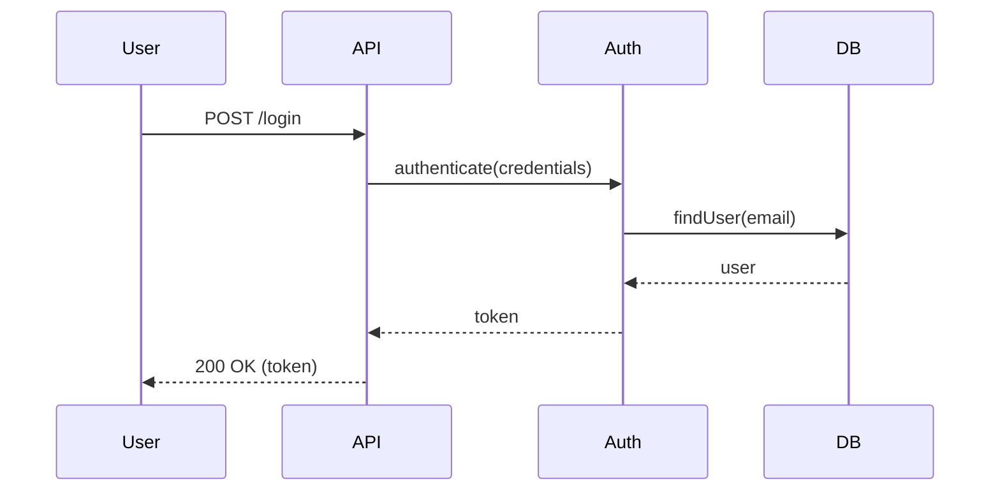

# create-design: 設計書作成

設計書作成スキルは、C4モデルによるアーキテクチャ設計、シーケンス図、データモデルを生成します。

## 概要

このスキルは以下を実行します：

1. **要件定義参照**: requirements.md を読み込んで要件を把握
2. **C4モデル設計**: Context, Container, Component, Code の4レベルで設計
3. **シーケンス図作成**: 主要な処理フローをシーケンス図で表現
4. **データモデル設計**: エンティティ、属性、リレーションを定義
5. **設計書生成**:
   - `docs/michi/YYYYMMDD-{pj-name}/spec/architecture.md`
   - `docs/michi/YYYYMMDD-{pj-name}/spec/sequence.md`
   - `docs/michi/YYYYMMDD-{pj-name}/spec/design.md`
6. **フェーズ更新**: project.json のフェーズを `design-generated` に更新

## 使用方法

### 自動発動

以下のキーワードで自動発動します：
- 「設計書を作成したい」
- 「アーキテクチャを設計」
- project.json の `phase: "requirements-generated"` の場合

### 明示的発動

```bash
/michi create-design {pj-name}
```

**例**:
```bash
/michi create-design user-auth
```

## 実行内容

### 1. 要件定義参照

`docs/michi/YYYYMMDD-{pj-name}/spec/requirements.md` を読み込んで要件を把握します。

### 2. C4モデル設計

C4モデルの4レベルで設計を行います：

**Level 1: Context（コンテキスト図）**
- システムの境界を定義
- 外部システムとの関係を明示

**Level 2: Container（コンテナ図）**
- アプリケーション、データベース、サービスを定義
- コンテナ間の通信を明示

**Level 3: Component（コンポーネント図）**
- 各コンテナ内のコンポーネントを定義
- コンポーネント間の依存関係を明示

**Level 4: Code（コード図）**
- クラス構造を定義
- 主要なインターフェースを明示

### 3. シーケンス図作成

主要な処理フローをMermaidシーケンス図で表現します：



### 4. データモデル設計

エンティティ、属性、リレーションを定義します：

```markdown
## エンティティ

### User
- id: UUID (PK)
- email: String (Unique)
- passwordHash: String
- createdAt: DateTime
- updatedAt: DateTime

### Session
- id: UUID (PK)
- userId: UUID (FK -> User.id)
- token: String (Unique)
- expiresAt: DateTime
```

### 5. 設計書生成

以下のファイルを作成します：

1. **architecture.md**: C4モデルによるアーキテクチャ設計
2. **sequence.md**: シーケンス図
3. **design.md**: 詳細設計（データモデル、API仕様、エラーハンドリングなど）

### 6. フェーズ更新

project.json のフェーズを更新します：

```json
{
  "phase": "design-generated",
  "updatedAt": "2026-01-17T00:00:00Z"
}
```

### 7. TODO抽出の自動提案

設計書生成後、Claude は自動的に TODO 抽出を提案します：

```text
設計書を生成しました。

設計上のリスクや不明点を TODO として管理しますか？
  - manage-todos scan {pj-name} を実行
```

ユーザーが同意した場合、`manage-todos scan` を実行して、設計書から TODO を抽出します。

## 次のステップ

設計が完了したら、次のステップに進みます：

### 推奨: TODO抽出

設計書からリスクや不明点を抽出してTODO管理を更新します。

`manage-todos` スキルを使用してTODOを抽出します：

```bash
/michi manage-todos scan {pj-name}
```

または自動発動：
```text
TODOを確認したい
```

**抽出対象**:
- 設計上のリスク（Risk）
- 技術選定の仮定（Assumption）
- 詳細設計の不明点（Question）
- 技術的負債（Tech Debt）

### オプション1: テスト計画

`plan-tests` スキルを使用してテスト計画を作成します。

```bash
/michi plan-tests {pj-name}
```

### オプション2: タスク分割

`create-tasks` スキルを使用してタスクに分割します。

```bash
/michi create-tasks {pj-name}
```

## 参照

- **C4モデル**: https://c4model.com/
- **Mermaid構文**: https://mermaid.js.org/
- **ワークフロー全体**: `../references/workflow-guide.md`
- **コマンドリファレンス**: `../references/command-reference.md`

---

**次のスキル**:
- `plan-tests` - テスト計画作成
- `create-tasks` - タスク分割
