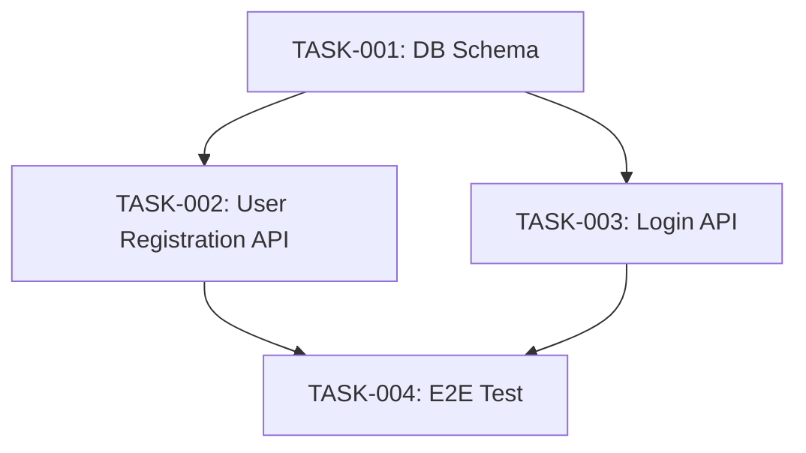

# create-tasks: タスク分割

タスク分割スキルは、設計を実装可能なタスクに分割し、依存関係をマッピングします。

## 概要

このスキルは以下を実行します：

1. **設計書参照**: design.md, architecture.md, test-plan を読み込んで設計を把握
2. **タスク分割**: 1-3日単位のタスクに分割
3. **依存関係マッピング**: タスク間の依存関係を明示
4. **優先度設定**: タスクの優先度を設定
5. **タスク一覧生成**: `docs/michi/YYYYMMDD-{pj-name}/tasks/tasks.md` を作成
6. **フェーズ更新**: project.json のフェーズを `tasks-generated` に更新

## 使用方法

### 自動発動

以下のキーワードで自動発動します：
- 「タスクに分割したい」
- 「タスク一覧を作成」
- project.json の `phase: "design-generated"` または `test-plan-generated` の場合に自動提案

### 明示的発動

```bash
/michi create-tasks {pj-name}
```

**例**:
```bash
/michi create-tasks user-auth
```

## サブエージェント活用（Plan + Explore）

タスク分割を**Planエージェント**で実行し、設計書読み込みを**Exploreエージェント**に委譲します：

### Phase 1: 設計書収集（Explore x 2）

| エージェント | 対象 | 出力 |
|-------------|------|------|
| 設計書収集 | design.md, architecture.md | 設計サマリー |
| テスト計画収集 | test-plan/strategy.md | テスト戦略サマリー |

### Phase 2: タスク分割分析（Plan）

Planエージェントで以下を分析：
- タスクの粒度（1-3日単位）
- 依存関係のトポロジカルソート
- 優先度設定

### Phase 3: ファイル生成（メインエージェント）

- tasks.md生成
- project.json更新

**Planエージェント活用のメリット**:
- タスク分割に特化した分析
- 依存関係の正確なマッピング
- 実装順序の最適化

**Exploreエージェント活用のメリット**:
- 設計書の高速読み込み
- コンテキスト収集の効率化

---

## 実行内容

### 1. 設計書参照

以下のファイルを読み込んで設計を把握します：
- `docs/michi/YYYYMMDD-{pj-name}/spec/design.md`
- `docs/michi/YYYYMMDD-{pj-name}/spec/architecture.md`
- `docs/michi/YYYYMMDD-{pj-name}/test-plan/strategy.md`

### 2. タスク分割

1-3日単位のタスクに分割します：

**分割原則**:
- **粒度**: 1タスクは1-3日で完了できる規模
- **独立性**: 可能な限り独立して実装できるタスク
- **テスト駆動**: 各タスクには対応するテストが含まれる
- **コードサイズ**: 1タスクあたり最大500行の変更（推奨）

### 3. 依存関係マッピング

タスク間の依存関係を明示します：

```markdown
## タスク一覧

### TASK-001: データベーススキーマ作成
- **説明**: User テーブルを作成
- **依存**: なし
- **優先度**: 高
- **見積もり**: 1日

### TASK-002: ユーザー登録API実装
- **説明**: POST /api/users エンドポイントを実装
- **依存**: TASK-001
- **優先度**: 高
- **見積もり**: 2日

### TASK-003: ログインAPI実装
- **説明**: POST /api/login エンドポイントを実装
- **依存**: TASK-001, TASK-002
- **優先度**: 高
- **見積もり**: 2日
```

### 4. タスク一覧生成

`docs/michi/YYYYMMDD-{pj-name}/tasks/tasks.md` を作成します：

```markdown
# タスク一覧: {pj-name}

## プロジェクト概要
...

## タスク依存関係図



## タスク一覧

### Phase 1: データベース
- TASK-001: データベーススキーマ作成

### Phase 2: API実装
- TASK-002: ユーザー登録API実装
- TASK-003: ログインAPI実装

### Phase 3: テスト
- TASK-004: E2Eテスト実装
```

### 5. フェーズ更新

project.json のフェーズを更新します：

```json
{
  "phase": "tasks-generated",
  "updatedAt": "2026-01-17T00:00:00Z"
}
```

## 次のステップ

タスク分割が完了したら、次のステップに進みます：

### 推奨: TDD実装

`dev` スキルを使用してTDD実装を開始します。

```bash
/michi dev {pj-name}
```

または自動発動：
```
実装したい
```

## 参照

- **コードサイズガイドライン**: `../../rules/code-size-rules.md`
- **ワークフロー全体**: `../references/workflow-guide.md`
- **コマンドリファレンス**: `../references/command-reference.md`

---

**次のスキル**: `dev` - TDD実装 + 品質自動化
