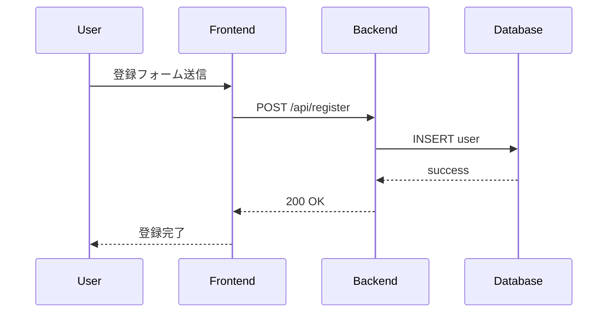

# Michi スキル - マルチリポジトリガイド

このドキュメントは、Michiスキルを使用したマルチリポジトリプロジェクトの開発方法を説明します。

## 目次

- [概要](#概要)
- [マルチリポジトリワークフロー](#マルチリポジトリワークフロー)
- [コマンド詳細](#コマンド詳細)
- [ベストプラクティス](#ベストプラクティス)
- [トラブルシューティング](#トラブルシューティング)

---

## 概要

### マルチリポジトリとは

複数のリポジトリにまたがるプロジェクトを、**統合仕様** で管理し、各リポジトリに展開する開発手法です。

### 主な特徴

- **統合仕様管理**: 1つの仕様書で複数リポジトリを管理
- **クロスリポジトリ整合性検証**: リポジトリ間のインターフェース不整合を検出
- **並行実装**: 複数リポジトリで並行してTDD実装
- **JIRA/Confluence連携**: 外部ツールとの統合

---

## マルチリポジトリワークフロー

### 全体の流れ

```
Phase 1: マルチリポジトリプロジェクト初期化
  /michi-multi-repo launch-pj "EC Platform" --jira KEY --confluence-space SPACE

Phase 2: 統合要件定義
  /michi-multi-repo create-requirements {project-name}

Phase 3: 統合設計
  /michi-multi-repo create-design {project-name}

Phase 4: クロスリポジトリ整合性検証
  /michi-multi-repo review-cross {project-name}

Phase 5: 各リポジトリへ仕様展開
  /michi-multi-repo propagate {project-name}

Phase 6: 全リポジトリ並行実装
  /michi-multi-repo dev-all {project-name}
```

---

## コマンド詳細

### 1. launch-pj - マルチリポジトリプロジェクト初期化

**目的**: 複数リポジトリにまたがるプロジェクトを初期化します。

**コマンド**:
```bash
/michi-multi-repo launch-pj "EC Platform" --jira KEY --confluence-space SPACE
```

**処理内容**:
1. マルチリポジトリプロジェクトのディレクトリ構造を作成
2. project.json に JIRA/Confluence 連携情報を設定
3. 統合仕様のテンプレートを生成

**ディレクトリ構造**:
```
.michi/multi-repo/
└── YYYYMMDD-ec-platform/
    ├── project.json             # JIRA/Confluence連携情報
    └── repos.json               # リポジトリ一覧

docs/michi-multi-repo/YYYYMMDD-ec-platform/
├── spec/
│   ├── requirements.md          # 統合要件定義
│   ├── architecture.md          # 統合アーキテクチャ
│   └── sequence.md              # クロスリポジトリシーケンス図
└── repos/
    ├── frontend/
    │   ├── requirements.md      # Frontend用要件定義
    │   └── architecture.md      # Frontend用設計
    ├── backend/
    │   ├── requirements.md      # Backend用要件定義
    │   └── architecture.md      # Backend用設計
    └── database/
        ├── requirements.md      # Database用要件定義
        └── architecture.md      # Database用設計
```

---

### 2. create-requirements - 統合要件定義

**目的**: 複数リポジトリにまたがる統合要件定義を生成します。

**コマンド**:
```bash
/michi-multi-repo create-requirements ec-platform
```

**処理内容**:
1. 統合要件定義の生成（EARS形式）
2. リポジトリ間の依存関係を明記
3. 各リポジトリへの要件の割り当て

**例**:
```markdown
# EC Platform - 統合要件定義

## Requirement 1: ユーザー登録機能

**リポジトリ**: frontend, backend, database

### Frontend
- ユーザーは登録フォームに必要情報を入力できる
- システムは入力検証を行う

### Backend
- システムは登録APIを提供する
- システムはパスワードを安全にハッシュ化する

### Database
- システムはユーザー情報を保存する
```

---

### 3. create-design - 統合設計

**目的**: 複数リポジトリにまたがる統合設計を生成します。

**コマンド**:
```bash
/michi-multi-repo create-design ec-platform
```

**処理内容**:
1. C4モデルによる統合アーキテクチャ設計
2. クロスリポジトリのシーケンス図
3. インターフェース定義

**例（Mermaid）**:


---

### 4. review-cross - クロスリポジトリ整合性検証

**目的**: 各リポジトリの仕様間の整合性を検証します。

**コマンド**:
```bash
/michi-multi-repo review-cross ec-platform
```

**処理内容**:
1. 各リポジトリの仕様を読み取り
2. インターフェース整合性のチェック
   - API エンドポイントの一致
   - データ型の一致
   - 依存関係の検証
3. 不整合箇所の報告

**チェック項目**:
- ✅ Frontend が呼び出す API が Backend に定義されているか
- ✅ データ型が一致しているか
- ✅ 依存関係が循環していないか

---

### 5. propagate - 各リポジトリへ仕様展開

**目的**: 統合仕様を各リポジトリに展開します。

**コマンド**:
```bash
/michi-multi-repo propagate ec-platform
```

**処理内容**:
1. 統合仕様を各リポジトリ用に分割
2. 並行実行で各リポジトリに展開
3. 各リポジトリの project.json を更新

**並行実行の例**:
```
[Task 1] Frontend 仕様展開 (並行)
[Task 2] Backend 仕様展開 (並行)
[Task 3] Database 仕様展開 (並行)
```

---

### 6. dev-all - 全リポジトリ並行実装

**目的**: 複数リポジトリで並行してTDD実装を行います。

**コマンド**:
```bash
/michi-multi-repo dev-all ec-platform
```

**処理内容**:
1. 依存関係を考慮した実行順序の決定
2. 並行実行で各リポジトリの TDD実装
3. 統合テストの実行

**実行順序の例**:
```
Phase 1: Database スキーマ作成
  ↓
Phase 2: Backend API 実装（並行）
  ↓
Phase 3: Frontend 実装（並行）
```

---

## ベストプラクティス

### 1. インターフェース定義を明確にする

各リポジトリ間のインターフェース（API、データ型）を明確に定義します。

**例**:
```markdown
## インターフェース定義

### POST /api/register

**Request**:
```json
{
  "username": "string",
  "email": "string",
  "password": "string"
}
```

**Response**:
```json
{
  "id": "number",
  "username": "string",
  "email": "string"
}
```
```

### 2. 依存関係を明記する

リポジトリ間の依存関係を明記し、循環依存を避けます。

**例**:
```markdown
## リポジトリ依存関係

- Frontend → Backend（API呼び出し）
- Backend → Database（データ永続化）
```

### 3. クロスリポジトリ整合性検証を定期的に実行

仕様変更後は、必ず `review-cross` を実行して整合性を確認します。

```bash
/michi-multi-repo review-cross ec-platform
```

### 4. 統合テストを実施

各リポジトリの実装完了後、統合テストを実施してリポジトリ間の連携を確認します。

---

## トラブルシューティング

### Q1: インターフェース不整合エラー

**原因**: Frontend が呼び出す API が Backend に定義されていない

**対処法**:
1. `review-cross` で不整合箇所を特定
2. Backend に不足しているAPI を追加
3. 再度 `review-cross` で確認

---

### Q2: 依存関係の循環

**原因**: リポジトリA → B → A のような循環依存がある

**対処法**:
1. 依存関係グラフを確認
2. リポジトリ間のインターフェースを再設計
3. 循環を解消

---

### Q3: 並行実装時のコンフリクト

**原因**: 複数リポジトリで同じリソース（DB テーブルなど）を変更している

**対処法**:
1. リソースの所有権を明確にする
2. 変更を調整して衝突を回避
3. 統合テストで検証

---

## まとめ

Michiスキルのマルチリポジトリ機能は、複数リポジトリにまたがるプロジェクトを統合仕様で管理し、クロスリポジトリ整合性検証と並行実装を提供します。

詳細については、以下のドキュメントを参照してください：

- **command-reference.md**: 全19機能の詳細リファレンス
- **workflow-guide.md**: 開発ワークフローの全体説明
- **triggers.md**: 発動トリガーの一覧
- **examples.md**: 使用例・ユースケース
