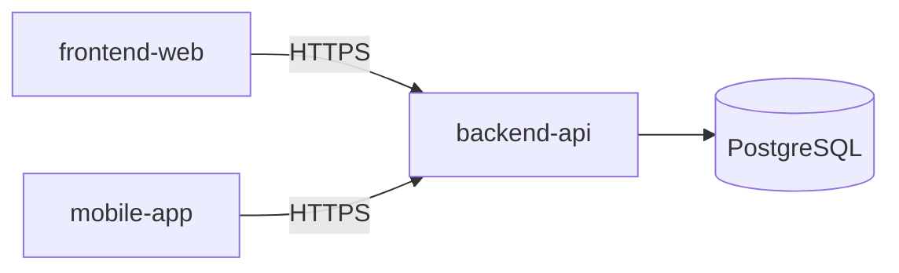

# multi-repo-create-design: マルチリポジトリ設計

C4モデルによるアーキテクチャ設計を行い、クロスリポジトリ整合性を考慮します。

## 概要

1. **C4モデル設計**: 全リポジトリ統合のアーキテクチャを設計
2. **コンテナ間連携**: リポジトリ間の通信を設計
3. **データフロー設計**: データの流れを明示

## 使用方法

```bash
/michi-multi-repo create-design {pj-name}
```

## 実行内容

統合設計書を作成します：

```markdown
# 統合設計: EC Platform

## C4モデル

### Level 1: Context
- システム境界
- 外部システムとの関係

### Level 2: Container
- frontend-web: React SPA
- backend-api: Node.js API Server
- mobile-app: React Native App

### コンテナ間連携
- frontend-web → backend-api: REST API (HTTPS)
- mobile-app → backend-api: REST API (HTTPS)

## データフロー


```

## 次のステップ

```bash
/michi-multi-repo review-cross {pj-name}
```

---

**次のスキル**: `multi-repo-review-cross`
