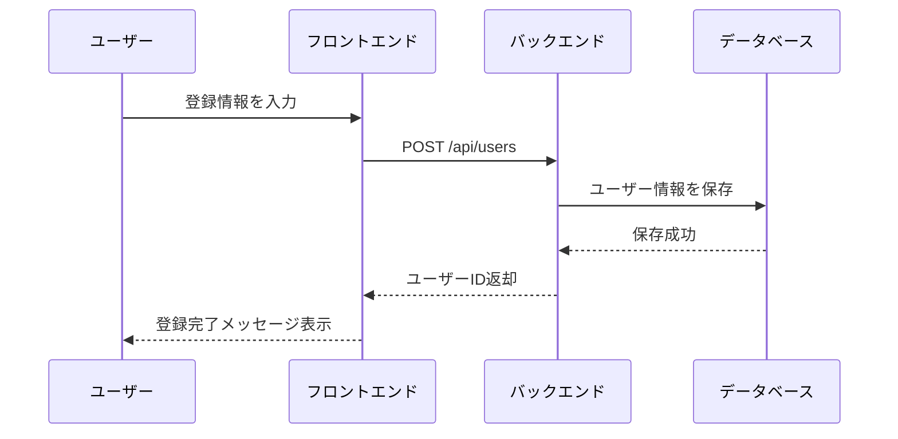
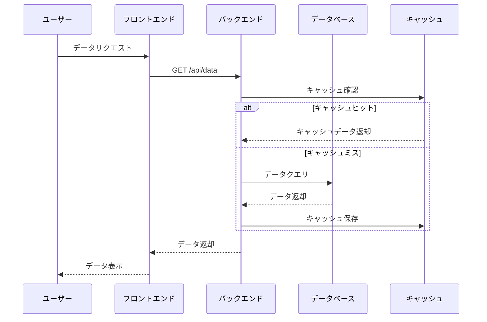
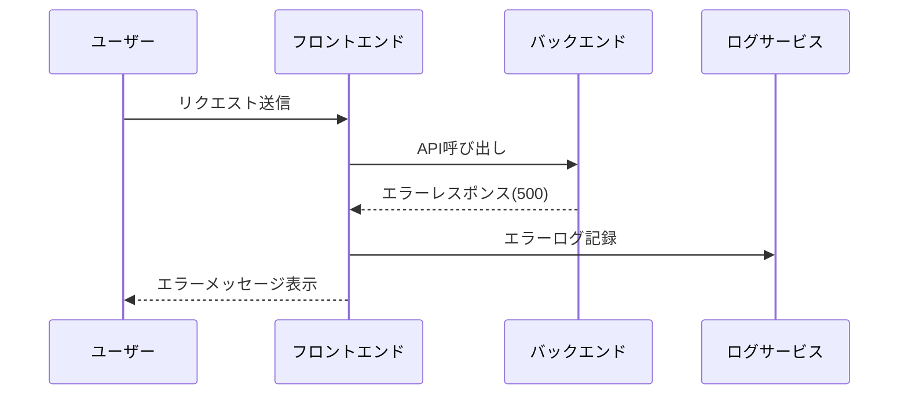

# {{PROJECT_NAME}} - シーケンス図

## プロジェクト情報

- **プロジェクト名**: {{PROJECT_NAME}}
- **JIRAキー**: {{JIRA_KEY}}
- **Confluenceスペース**: {{CONFLUENCE_SPACE}}
- **作成日時**: {{CREATED_AT}}

## 主要フローのシーケンス図

### ユーザー登録フロー

<!-- ユーザー登録フローを更新してください -->

### データ取得フロー

<!-- データ取得フローを更新してください -->

### エラーハンドリングフロー

<!-- エラーハンドリングフローを更新してください -->

## 変更履歴

| 日付 | バージョン | 変更内容 | 担当者 |
|------|-----------|---------|--------|
| {{CREATED_AT}} | 1.0.0 | 初版作成 | - |
