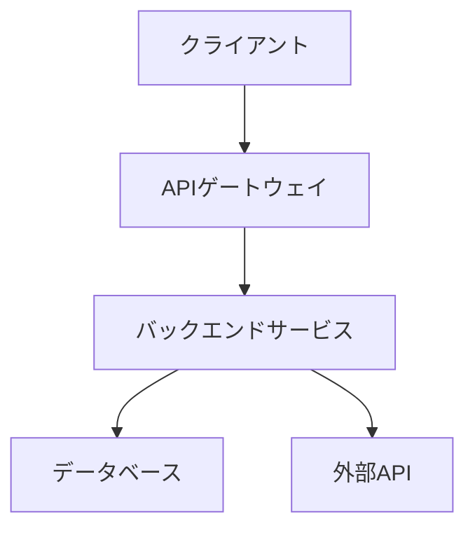
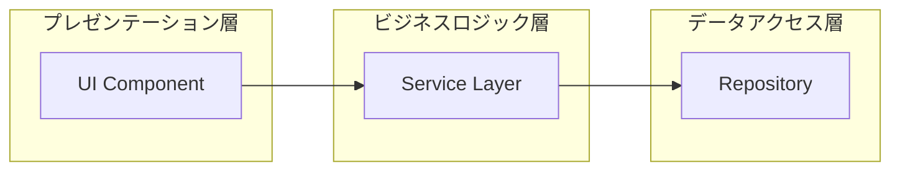
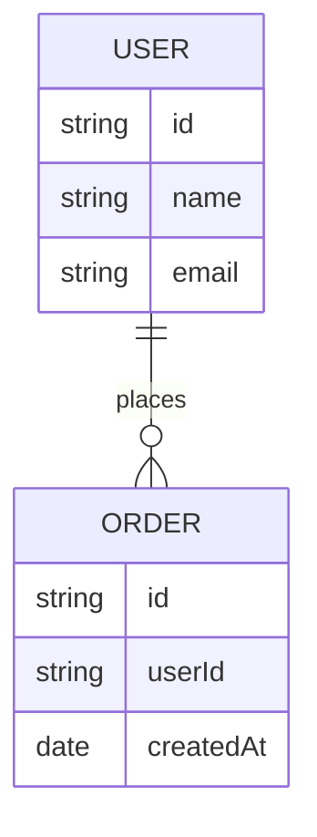
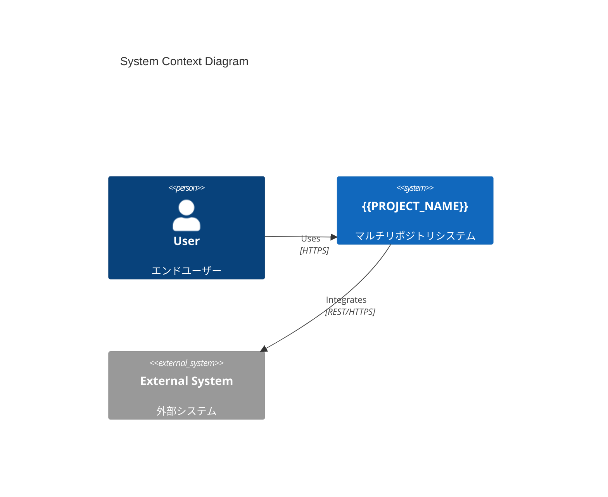
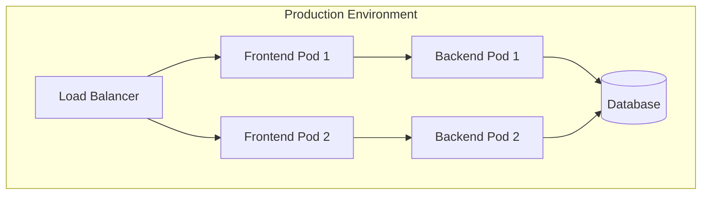
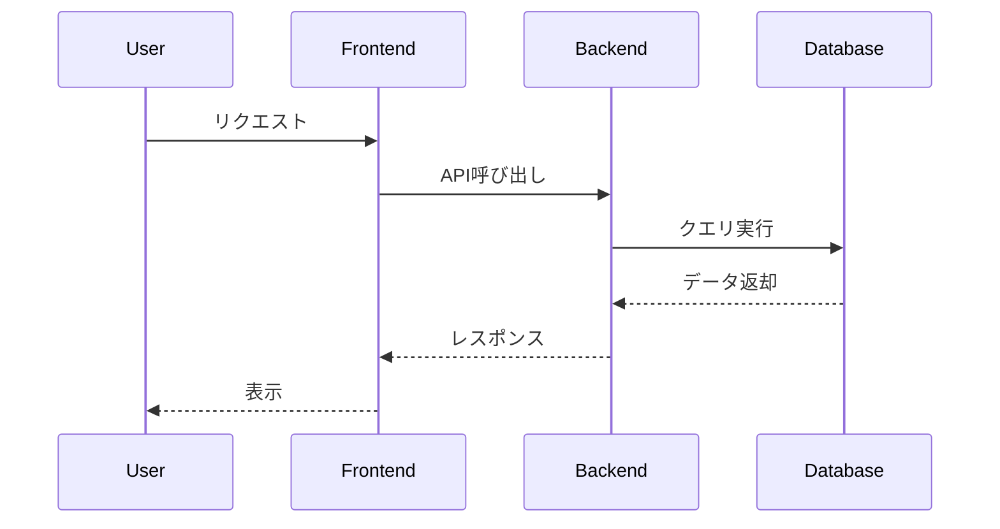

# {{PROJECT_NAME}} - アーキテクチャ設計書

## プロジェクト情報

- **プロジェクト名**: {{PROJECT_NAME}}
- **作成日時**: {{CREATED_AT}}

## システム構成図

<!-- システム構成図を更新してください -->

## アーキテクチャパターン

<!-- 採用するアーキテクチャパターンを記述してください -->
<!-- 例: マイクロサービス、レイヤードアーキテクチャ、ヘキサゴナルアーキテクチャ -->

### レイヤー構成

<!-- レイヤー構成を記述してください -->

## コンポーネント図

<!-- コンポーネント図を更新してください -->

## 技術スタック

### フロントエンド

<!-- フロントエンド技術スタックを記述してください -->

### バックエンド

<!-- バックエンド技術スタックを記述してください -->

### データベース

<!-- データベース技術スタックを記述してください -->

### インフラストラクチャ

<!-- インフラストラクチャを記述してください -->

## データモデル

<!-- データモデルを記述してください -->

## セキュリティアーキテクチャ

<!-- セキュリティアーキテクチャを記述してください -->

## スケーラビリティ設計

<!-- スケーラビリティ設計を記述してください -->

## リポジトリ横断アーキテクチャ

<!-- AI生成コマンド（/michi_multi_repo:spec-design）を使用すると、自動的にリポジトリ横断アーキテクチャが挿入されます -->

### C4モデル - システムコンテキスト図

### サービス間通信

<!-- AI生成コマンドを使用すると、サービス間通信の詳細が自動生成されます -->

| 呼び出し元 | 呼び出し先 | 方式 | プロトコル | 用途 |
|-----------|-----------|------|-----------|------|
| Frontend | API Gateway | 同期 | REST/HTTPS | ユーザーリクエスト処理 |
| Service A | Service B | 同期 | gRPC | サービス間通信 |
| Service B | Service C | 非同期 | Kafka | イベント通知 |

### 共有コンポーネント

<!-- AI生成コマンドを使用すると、共有コンポーネントが自動的に抽出されます -->

**共通ライブラリ**:
- `@org/shared-types`: 型定義（全コンポーネントで共有）
- `@org/logger`: 統一ログライブラリ

**共通インフラ**:
- Elasticsearch: ログ集約
- Prometheus + Grafana: メトリクス監視
- 認証基盤: 統合認証サービス

### デプロイメントアーキテクチャ

### データフロー

<!-- AI生成コマンドを使用すると、サービス間のデータフローシーケンス図が自動生成されます -->

## 変更履歴

| 日付 | バージョン | 変更内容 | 担当者 |
|------|-----------|---------|--------|
| {{CREATED_AT}} | 1.0.0 | 初版作成 | - |
