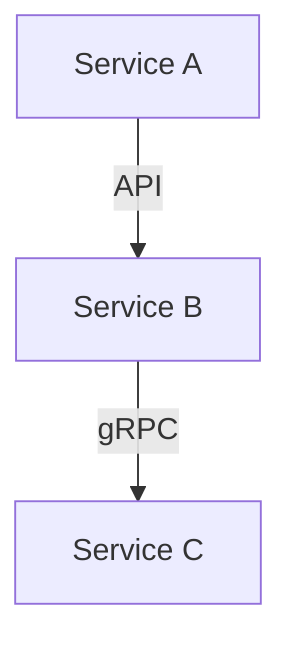

# {{PROJECT_NAME}} - 要件定義書

## プロジェクト情報

- **プロジェクト名**: {{PROJECT_NAME}}
- **作成日時**: {{CREATED_AT}}

## 概要

このドキュメントは、{{PROJECT_NAME}}プロジェクトの要件定義書です。

## ビジネス価値

<!-- プロジェクトのビジネス価値を記述してください -->

### 対象ユーザー

<!-- 対象ユーザーを記述してください -->
- プロジェクトリーダー
- アーキテクト
- 開発者
- QAエンジニア

### 主要機能

<!-- 主要機能を記述してください -->

## 受入基準（EARS形式）

### 必須要件

<!-- EARS形式（Event-Action-Response-System）で受入基準を記述してください -->
<!-- 例: -->
<!-- - WHEN ユーザーがプロジェクトを初期化する際、IF プロジェクト名が有効である場合、THEN システムはプロジェクトディレクトリを作成し、成功メッセージを表示する。 -->

### 任意要件

<!-- 任意要件を記述してください -->

## 技術的制約

<!-- 技術的制約を記述してください -->

## 非機能要件

### パフォーマンス要件

<!-- パフォーマンス要件を記述してください -->

### セキュリティ要件

<!-- セキュリティ要件を記述してください -->

### 保守性要件

<!-- 保守性要件を記述してください -->

## リスクと制限事項

<!-- リスクと制限事項を記述してください -->

## コンポーネント構成

### 登録リポジトリ一覧

<!-- AI生成コマンド（/michi_multi_repo:spec-requirements）を使用すると、自動的に登録リポジトリ情報が挿入されます -->

| コンポーネント名 | リポジトリURL | ブランチ | 役割 | 技術スタック |
|-----------|---------------|---------|------|-------------|
| <!-- 例: frontend --> | <!-- 例: https://github.com/org/frontend --> | <!-- 例: main --> | <!-- 例: ユーザーインターフェース --> | <!-- 例: React, TypeScript --> |

### サービス間依存関係

<!-- AI生成コマンドを使用すると、サービス間の依存関係図が自動生成されます -->

## インターフェース要件

### API契約

<!-- サービス間のAPI契約を記述してください -->
<!-- AI生成コマンドを使用すると、要件定義書から自動的にAPI契約が抽出されます -->

**コンポーネントA → コンポーネントB**
- エンドポイント: `POST /api/v1/resource`
- プロトコル: HTTP/REST
- データ形式: JSON

### イベント契約

<!-- Pub/Subイベントのスキーマを記述してください -->
<!-- AI生成コマンドを使用すると、イベント駆動設計のスキーマが自動生成されます -->

**コンポーネントA → コンポーネントB**
- イベント: `resource.created`
- プロトコル: Kafka / RabbitMQ
- スキーマ: { resourceId, name, createdAt }

## 変更履歴

| 日付 | バージョン | 変更内容 | 担当者 |
|------|-----------|---------|--------|
| {{CREATED_AT}} | 1.0.0 | 初版作成 | - |
