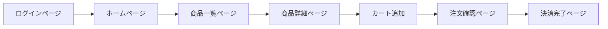

# {{FEATURE_NAME}} - E2Eテスト仕様書

## テスト情報

- **機能名**: {{FEATURE_NAME}}
- **作成日時**: {{CREATED_AT}}
- **テストタイプ**: E2Eテスト（End-to-End Test）

## テスト目的

<!-- このテストで検証したい内容を記述してください -->
- ユーザー視点での主要シナリオが正常に動作することを確認
- フロントエンドからバックエンド、データベースまでの一連のフローを検証
- ブラウザ上での実際のユーザー操作をシミュレーション

## テスト対象

### ユーザージャーニー

<!-- テスト対象のユーザーフローを記述してください -->



## テストシナリオ

### シナリオ1: ユーザー登録からログインまで

**前提条件**:
- アプリケーションが起動している
- テストユーザーが未登録の状態

**テストステップ**:

| ステップ | 操作内容 | 期待結果 |
|---------|---------|---------|
| 1 | トップページにアクセス | トップページが表示される |
| 2 | 「新規登録」ボタンをクリック | 登録フォームが表示される |
| 3 | 名前、メール、パスワードを入力 | 各フィールドに入力できる |
| 4 | 「登録」ボタンをクリック | 登録完了メッセージが表示される |
| 5 | ログインページに遷移 | ログインフォームが表示される |
| 6 | 登録したメール・パスワードでログイン | ホームページにリダイレクトされる |
| 7 | ユーザー名が表示されることを確認 | ヘッダーに「〇〇さん」と表示される |

**期待される成功基準**:
- [ ] 全てのステップが正常に完了する
- [ ] ページ遷移が正しく動作する
- [ ] エラーメッセージが表示されない
- [ ] ユーザーデータがDBに保存される

### シナリオ2: 商品購入フロー

**前提条件**:
- ユーザーがログイン済み
- 商品が登録されている

**テストステップ**:

| ステップ | 操作内容 | 期待結果 |
|---------|---------|---------|
| 1 | 商品一覧ページにアクセス | 商品一覧が表示される |
| 2 | 商品画像をクリック | 商品詳細ページに遷移 |
| 3 | 「カートに追加」ボタンをクリック | カートアイコンに「1」と表示される |
| 4 | カートアイコンをクリック | カート内容が表示される |
| 5 | 「購入手続きに進む」ボタンをクリック | 注文確認ページに遷移 |
| 6 | 配送先・支払い方法を確認 | 入力内容が正しく表示される |
| 7 | 「注文を確定」ボタンをクリック | 注文完了ページに遷移 |
| 8 | 注文番号が表示されることを確認 | 「注文番号: #12345」と表示される |

**期待される成功基準**:
- [ ] カートに正しく商品が追加される
- [ ] 注文情報がDBに保存される
- [ ] 在庫数が減少する
- [ ] 確認メールが送信される

### シナリオ3: エラーハンドリング

**前提条件**:
- アプリケーションが起動している

**テストステップ**:

| ステップ | 操作内容 | 期待結果 |
|---------|---------|---------|
| 1 | ログインページにアクセス | ログインフォームが表示される |
| 2 | 不正なメールアドレスを入力 | フィールドがエラー状態になる |
| 3 | 「ログイン」ボタンをクリック | 「メールアドレスの形式が正しくありません」と表示される |
| 4 | 正しいメールアドレスを入力 | エラーが消える |
| 5 | 間違ったパスワードを入力してログイン | 「メールアドレスまたはパスワードが正しくありません」と表示される |

**期待される成功基準**:
- [ ] バリデーションエラーが適切に表示される
- [ ] エラーメッセージがユーザーフレンドリー
- [ ] ログインが失敗してもセキュリティが保たれる

## テストデータ

### テストユーザー

```json
{
  "testUser1": {
    "name": "テスト太郎",
    "email": "test-taro@example.com",
    "password": "TestP@ssw0rd123"
  },
  "testUser2": {
    "name": "テスト花子",
    "email": "test-hanako@example.com",
    "password": "TestP@ssw0rd456"
  }
}
```

### テスト商品データ

```json
{
  "product1": {
    "name": "テスト商品A",
    "price": 1000,
    "stock": 10
  },
  "product2": {
    "name": "テスト商品B",
    "price": 2000,
    "stock": 5
  }
}
```

## セレクタ定義

<!-- ページ要素のセレクタを定義してください -->

| 要素名 | セレクタ | 種類 |
|-------|---------|------|
| ログインボタン | `[data-testid="login-button"]` | data-testid |
| メールアドレス入力 | `input[name="email"]` | name |
| パスワード入力 | `input[type="password"]` | type |
| エラーメッセージ | `.error-message` | class |
| カートアイコン | `#cart-icon` | id |

## テスト環境

### ブラウザ環境

- **Chrome**: 最新版
- **Firefox**: 最新版
- **Safari**: 最新版（macOSのみ）
- **Edge**: 最新版（Windowsのみ）

### 実行環境

- **テストフレームワーク**: Playwright / Cypress / Puppeteer
- **ヘッドレスモード**: CI環境では有効、ローカルでは無効
- **スクリーンショット**: テスト失敗時に自動保存
- **動画録画**: 全テストケースで有効

## セットアップ・クリーンアップ

### テスト前処理

```bash
# データベースリセット
npm run db:reset:e2e

# テストデータ投入
npm run db:seed:e2e

# アプリケーション起動（テストモード）
npm run start:test
```

### テスト後処理

```bash
# アプリケーション停止
npm run stop:test

# テストデータ削除
npm run db:clean:e2e

# スクリーンショット・動画の保存
# → artifacts/ ディレクトリに自動保存
```

## 前提条件

- [ ] テスト用データベースのセットアップ
- [ ] ブラウザドライバーのインストール
- [ ] アプリケーションのビルド完了
- [ ] テスト環境の起動

## 実行コマンド

```bash
# 全テスト実行
npm run test:e2e

# 特定のブラウザで実行
npm run test:e2e -- --browser=chrome

# ヘッドレスモードで実行
npm run test:e2e -- --headless

# 特定のシナリオのみ実行
npm run test:e2e -- --grep="ユーザー登録"
```

## 期待される成功基準

- [ ] 全シナリオが正常に完了する
- [ ] ページ読み込み時間が3秒以内
- [ ] 各操作のレスポンスが1秒以内
- [ ] 全ブラウザで動作する
- [ ] スクリーンショットに視覚的な問題がない

## トラブルシューティング

### よくある問題

| 問題 | 原因 | 解決方法 |
|------|------|---------|
| タイムアウトエラー | 要素が見つからない | セレクタの修正、待機時間の延長 |
| 画面遷移失敗 | 非同期処理の待機不足 | `waitForNavigation()` を追加 |
| データ不整合 | 前回のテストデータが残存 | クリーンアップ処理を強化 |

## 変更履歴

| 日付 | 変更者 | 変更内容 |
|------|-------|---------|
| {{CREATED_AT}} | - | 初版作成 |
